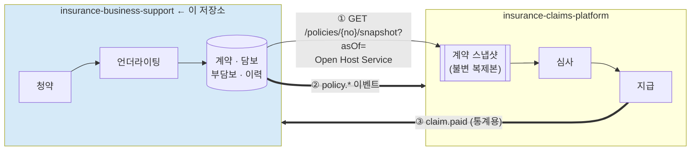

# 보험 계약 · 언더라이팅 시스템

> 과거 어느 시점의 계약이든 **그때 그대로 재현**하는, 계약 정보의 원천(Source of Truth)

[]()
[]()
[]()
[]()

---

## 이 시스템이 푸는 문제

보험금 청구 심사는 **사고일 시점의 계약**을 봐야 한다. 그런데 사고일은 언제나 과거다.

```
2026-01-01  계약 체결 — 척추 부담보 5년
2026-03-14  사고 발생          ← 이 시점의 조건으로 심사해야 함
2026-04-02  청구 접수 → 부담보 저촉으로 부지급
2026-05-20  ★ 착오 발견: 부담보는 잘못 입력된 것이었음 → 소급 정정
2026-06-01  민원 접수 → 재심사
```

6월에 계약을 조회하면 부담보가 없다. **그러면 4월의 부지급 판단을 설명할 수 없다.**
"우리가 틀렸다"는 것조차 증명하지 못한다.

이 시스템은 **두 개의 시간축**으로 그 문제를 푼다.

| 축 | 질문 |
|---|---|
| **유효시간** (`valid_from`/`valid_to`) | "2026-03-14에 이 계약은 어떤 상태였나?" |
| **기록시간** (`recorded_at`/`superseded_at`) | "그 답을 우리는 언제부터 알고 있었나?" |

```http
GET /policies/P2026-0001234/snapshot?asOf=2026-03-14
→ 부담보 없음   (지금 아는 진실)

GET /policies/P2026-0001234/snapshot?asOf=2026-03-14&knownAt=2026-04-02T10:15:00+09:00
→ 부담보 있음   (4월에 우리가 알던 것 — 부지급 근거의 재현)
```

**시점 재현성 100%가 이 시스템의 절대 요구사항이다.**

---

## 시스템 구성

2개 저장소로 구성된 시스템의 **계약(Policy) 측**이다.



| 저장소 | 역할 |
|---|---|
| `insurance-business-support` (이 저장소) | 청약 · 언더라이팅 · 계약 보전 — **계약 정보의 원천** |
| [`insurance-claims-platform`](https://github.com/hyunolike/insurance-claims-platform) | 실손의료보험 청구 접수 · 심사 · 지급 |

**의존 방향은 claims → business-support 단방향이다.** 이 시스템은 claims 없이도 완전히 동작한다.

경계와 통합 방식: [`docs/design/01-context-map.md`](docs/design/01-context-map.md)

---

## 핵심 설계 결정

### 1. 기존 행을 절대 수정하지 않는다

```
변경(Endorsement)  "오늘부터 바뀐다"      → 기존 구간 종료 + 새 행 INSERT
정정(Correction)   "과거가 원래 그랬다"   → superseded_at 마킹 + 새 행 INSERT
```

이 구분이 정확해야 시스템이 동작한다. **정정만이 과거 스냅샷을 바꾸고**,
`policy.corrected` 이벤트로 claims의 재심사를 유발한다.

DB가 이를 강제한다:

```sql
-- 유효구간 겹침을 DB가 거부
ALTER TABLE coverage_version ADD CONSTRAINT coverage_no_overlap
EXCLUDE USING gist (
    policy_no WITH =, coverage_code WITH =,
    daterange(valid_from, valid_to) WITH &&
) WHERE (superseded_at IS NULL);

-- superseded_at 외의 UPDATE를 트리거가 거부
CREATE TRIGGER coverage_version_immutable BEFORE UPDATE ON coverage_version
    FOR EACH ROW EXECUTE FUNCTION reject_history_mutation();
```

### 2. 언더라이팅 결정이 청구 부지급까지 끊기지 않고 연결된다

```
[청약]   고지: "5년 내 수술" = 예 → 2024년 요추 추간판탈출증 수술
   ↓ U-DSC-030 (riskCategory=MUSCULOSKELETAL, severity=MODERATE)
[인수]   EXCLUDED — 척추 및 그 부속기관, M40-M54, 5년
   ↓ Exclusion { uwCaseNo: "U-2026-0012" }
[스냅샷] exclusions: [{ kcdRanges: ["M40-M54"], until: "2031-01-01" }]
   ↓
[청구]   2028-05-10, 주상병 M51.2
   ↓ claims R-POL-050
[판정]   DENIED: D-POL-004 (부담보 조건에 해당)
   ↓ 역추적
         Exclusion.uwCaseNo → UwRuleTrace → "5년 내 입원 이력으로 부과"
```

**"왜 내 척추는 보장이 안 되나"에 뿌리까지 답할 수 있다.**

### 3. 불완전판매를 시스템이 막는다

부담보·할증 인수는 **고객 동의가 필요**하다. 동의 기록 없이는 계약이 성립하지 않는다.

```java
if (uwCase.decision().requiresConsent() && !consent.isValidFor(uwCase)) {
    throw new ConsentRequiredException(uwCase.caseNo());   // → 409
}
```

납입최고(독촉) 없는 실효도 마찬가지다. 최고 발송 기록이 없으면 `LAPSED` 전환이 거부된다.
절차를 빠뜨린 실효는 무효가 될 수 있기 때문이다.

### 4. 최소권한 — claims에 필요한 것만 준다

| 제공 ✅ | 미제공 ❌ |
|---|---|
| 계약 상태, 보험기간, 담보 조건 | 고지사항 원문 (민감 건강정보) |
| **부담보 KCD 범위** (심사 필수) | 건강진단 결과 |
| 보험료 수납 시점, 유예 여부 | 계약자 성명·주소·연락처 |
| 피보험자 식별자(CI), 출생연도 | 모집인·수수료 정보, 보험료 금액 |

주민등록번호는 **저장하지 않는다.** CI 또는 내부 고객키만 쓴다.

---

## 기술 스택

| 영역 | 선택 |
|---|---|
| 언어 | Java 21 (LTS) |
| 프레임워크 | Spring Boot 3.x — **도메인 모듈에서는 배제** |
| 빌드 | Gradle 멀티모듈 |
| DB | **PostgreSQL 15** — `btree_gist`, `daterange`, `EXCLUDE` 제약 필수 |
| 마이그레이션 | Flyway |
| 메시징 | Kafka (Transactional Outbox 경유) |
| 캐시 | Redis (과거 스냅샷은 사실상 영구 캐시) |
| 테스트 | JUnit 5, AssertJ, **Testcontainers**, ArchUnit |

> PostgreSQL 의존도가 높다. `EXCLUDE USING gist`는 이식할 수 없다.
> 이식성보다 **데이터 정확성**을 택한 의도적 결정이다 — 계약 이력의 모순은 치명적이다.

---

## 모듈 구조

```
policy-domain/               ← 순수 자바. Spring 의존성 0 (클래스패스에 없음)
policy-application/          ← 유스케이스, 포트 정의
policy-underwriting/         ← 언더라이팅 룰 엔진
policy-adapter-web/          ← REST (스냅샷 API)
policy-adapter-persistence/  ← JPA, Flyway, Bitemporal 저장소
policy-adapter-messaging/    ← Kafka, Outbox 릴레이
policy-adapter-external/     ← 건강진단·적부조사 (스텁)
policy-bootstrap/            ← Spring Boot 앱
```

---

## 문서

| 문서 | 내용 |
|---|---|
| [00. 도메인 사전](docs/design/00-domain-glossary.md) | 청약·언더라이팅·계약 용어, **Bitemporal 개념** |
| [01. 컨텍스트 맵](docs/design/01-context-map.md) | 두 레포 경계, 업스트림으로서의 의무 |
| [02. 도메인 모델](docs/design/02-domain-model.md) | 애그리거트, **변경 vs 정정**, 부활 |
| [03. 언더라이팅](docs/design/03-underwriting.md) | **룰 카탈로그 7단계**, 인수 결정 워크스루 |
| [04. 이벤트·통합](docs/design/04-events-and-integration.md) | 이벤트 카탈로그, Outbox, 계약 테스트 |
| [05. API](docs/design/05-api.md) | **스냅샷 API 전체 명세** |
| [06. 데이터 모델](docs/design/06-data-model.md) | **Bitemporal 스키마**, EXCLUDE 제약 |
| [07. 아키텍처](docs/design/07-architecture.md) | 모듈 구조, 아키텍처 강제 장치 |
| [08. 로드맵](docs/design/08-roadmap.md) | Phase 0·1·5·6, 완료 조건 |

---

## 시작하기

> **Phase 0(골격) 완료.** 멀티모듈 구조·`Temporal` 시점 판정·아키텍처 강제 장치·CI·Outbox 기반이 동작한다.
> 계약 모델과 스냅샷 API는 [로드맵](docs/design/08-roadmap.md) Phase 1에서 들어간다.

### 요구사항

- Java 21
- Docker & Docker Compose

### 실행

```bash
cp .env.example .env      # 비밀값 설정 (미설정 시 기동 실패)
docker compose up -d      # PostgreSQL(5433), Redis(6380), Kafka(9092 공유)
./gradlew clean build
./gradlew :policy-bootstrap:bootRun   # 8081
```

> 포트가 claims와 다르다 (앱 8081, DB 5433, Redis 6380).
> 두 서비스를 동시에 띄워 레포 간 E2E를 돌리기 위함이다. **Kafka는 공유한다.**

### 검증

```bash
./gradlew build                                        # 전체 빌드 + 테스트
./gradlew test --tests '*ArchitectureTest'             # 아키텍처 규칙
./gradlew :policy-domain:test --tests '*TemporalTest'  # ★ 시점 재현성
./gradlew jacocoTestCoverageVerification               # 커버리지 게이트
```

통합 테스트(Flyway, `EXCLUDE USING gist` 제약, Outbox 트랜잭션 원자성)는 Testcontainers로 돈다.
**Docker가 없으면 실패가 아니라 skip** 되므로 로컬에 Docker 없이도 빌드는 통과한다.

claims와의 계약 테스트(`./gradlew contractTest`)는 스냅샷 API가 생기는 Phase 1부터 돈다.

---

## 개발 규약

### 브랜치

| 브랜치 | 용도 |
|---|---|
| `main` | 배포 기준 |
| `develop` | 통합 |
| `feat/#이슈` · `fix/#이슈` · `docs/#이슈` · `refactor/#이슈` | 작업 |

`main`/`develop` 직접 푸시 금지. PR은 **CI 전체 통과 필수**.

### 커밋

```
<type>: <내용> #<이슈번호>

feat · fix · docs · refactor · test · chore
```

### 머지 전 체크

```
□ ./gradlew build 통과
□ ArchUnit 규칙 통과
□ 시점 재현성 테스트 통과 (TemporalTest)
□ contractTest 통과 (Phase 1부터 — claims와의 계약)
□ 커버리지 게이트 통과 (도메인 브랜치 85% / 라인 90%)
□ OpenAPI drift 없음 (Phase 6부터, API 변경 시)
□ 해당 Phase의 완료 조건 충족
```

### ⚠️ 업스트림으로서의 책임

이 저장소는 claims의 **업스트림**이다. 스냅샷 API는 공표된 공용 계약이다.

| 의무 | 위반 시 |
|---|---|
| 같은 `(policyNo, asOf, knownAt)`은 **영원히 같은 응답** | 청구 심사 재현 불가 → 분쟁 대응 실패 |
| 필드 추가만 자유, 삭제·의미 변경은 새 버전 | claims 파싱 실패 |
| 계약 테스트 통과 | **이 저장소의 빌드가 실패** |
| 소급 정정 시 `policy.corrected` 발행 | claims가 틀린 근거로 계속 지급 |

---

## 라이선스

교육 및 포트폴리오 목적으로 작성되었습니다.

> 본 저장소의 인수 기준(연령·직업급수·할증률·부담보 기간)과 고지의무 항목은 **설계 예시**이며,
> 실제 보험사 인수 규정·약관·관련 법령으로 검증되지 않았습니다. 실무 적용 시 반드시 확인이 필요합니다.
