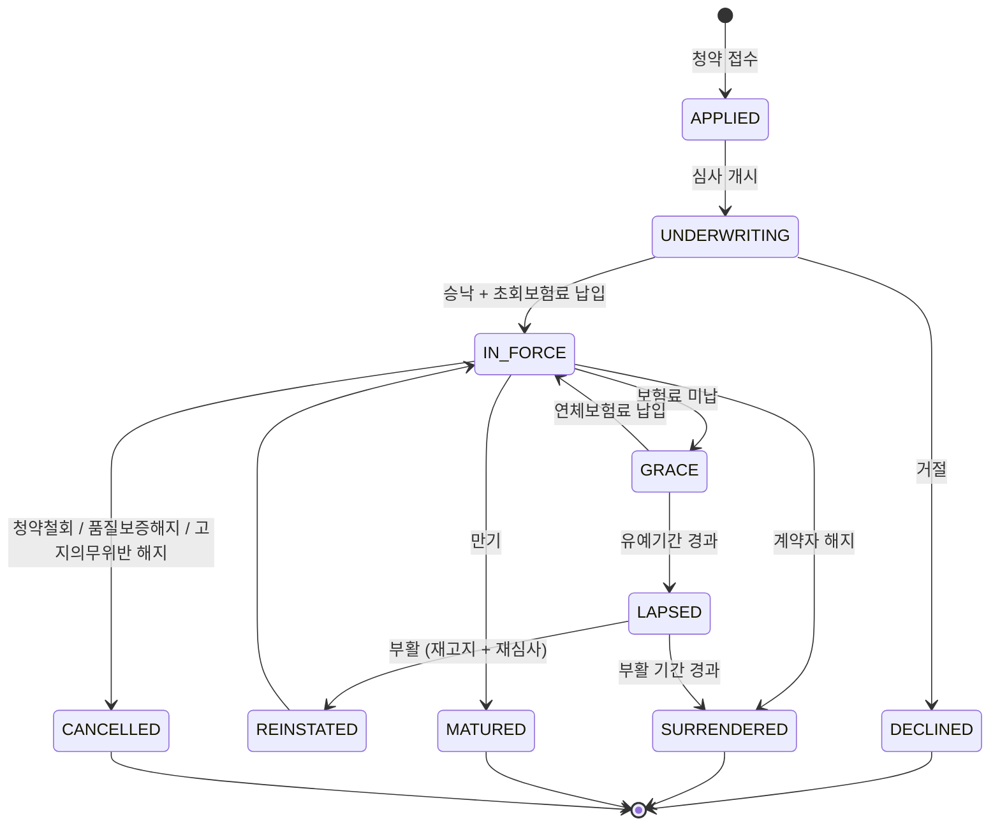

# 00. 도메인 사전 — 계약 · 언더라이팅

> 이 문서가 **유비쿼터스 언어의 원천**이다. 코드의 클래스명·필드명·이벤트명·DB 컬럼명이 모두 여기를 따른다.
> 짝 저장소 `insurance-claims-platform`의 도메인 사전과 겹치는 용어는 **이 문서가 정본**이다 (계약 축의 원천이므로).

---

## 0. 이 컨텍스트의 책임

이 시스템은 **"이 사람에게, 어떤 조건으로, 언제부터 언제까지 보장을 제공하는가"**를 결정하고 유지한다.

보상(claims)이 "얼마를 줄 것인가"라면, 여기는 **"애초에 무엇을 약속했는가"**다.

핵심 요구는 하나다:

> **과거 어느 시점의 계약 상태든, 그때 그대로 재현할 수 있어야 한다.**

청구 심사는 사고일 시점의 계약을 봐야 하고, 사고일은 늘 과거다.
계약이 그 뒤로 바뀌었더라도 **사고일의 사실**을 답할 수 있어야 한다. 이것이 이 컨텍스트의 존재 이유다.

---

## 1. 청약 · 언더라이팅

| 용어 | 영문/코드 | 정의 |
|---|---|---|
| 청약 | `Application` | 보험 가입 신청. 계약이 아직 아님 |
| 청약서 | `ApplicationForm` | 청약 시 제출하는 서식 |
| 계약자 | `PolicyHolder` | 보험료 납입 의무자, 계약 변경 권한자 |
| 피보험자 | `Insured` | 보험사고의 대상이 되는 사람 |
| 수익자 | `Beneficiary` | 보험금 수령인 |
| 고지의무 | `DisclosureDuty` | 계약 전 알릴 의무. 질병 이력·직업·흡연 등 |
| 고지사항 | `DisclosureItem` | 고지의무의 개별 질문 항목과 답변 |
| 언더라이팅 | `Underwriting` | 인수 심사. 위험을 평가해 인수 여부·조건을 정함 |
| 자동 언더라이팅 | `AUW` | 룰 기반 자동 인수 심사 |
| 계약심사자 | `Underwriter` | AUW가 회부한 건을 판단하는 사람 |
| 직업급수 | `OccupationClass` | 위험도에 따른 직업 등급(1~3급 등). 보험료·인수 제한에 영향 |
| 의적 심사 | `MedicalUnderwriting` | 진단서·건강진단 결과로 하는 심사 |
| 건강진단 | `MedicalExam` | 보험사 지정 검진 |
| 적부조사 | `FieldInvestigation` | 고지 내용의 사실 여부를 현장 확인 |
| 인수 | `Accept` | 계약을 받아들임 |
| 표준체 | `StandardRisk` | 추가 조건 없이 인수 |
| 할증 | `Rating` | 보험료를 올려서 인수 |
| **부담보** | `Exclusion` | 특정 부위·질병을 일정 기간 보장 제외하고 인수. **claims의 부지급 판정에 직결** |
| 감액 | `ReducedBenefit` | 보험가입금액을 줄여 인수 |
| 연기 | `Postpone` | 일정 기간 후 재심사 |
| 거절 | `Decline` | 인수하지 않음 |
| 승낙 | `Acceptance` | 보험사가 청약을 받아들이는 의사표시 |
| 책임개시일 | `effectiveDate` | 보장이 시작되는 날. **초회보험료 납입 + 승낙** |

### 1.1 고지의무 항목 (설계 예시)

> ⚠️ 실제 항목·기간은 상품과 약관에 따라 다르다. 아래는 **설계 기준선**이며 구현 시 검증 필요.

| 구분 | 질문 유형 |
|---|---|
| 3개월 이내 | 의사의 진찰·검사, 투약, 입원, 수술, 治療 권유 |
| 1년 이내 | 추가검사(재검사) 받은 사실 |
| 5년 이내 | 입원·수술·계속 치료·계속 투약 |
| 5년 이내 | 10대 중대질병 진단·치료 이력 |
| 현재 | 직업, 운전 여부, 위험한 취미 |
| 현재 | 흡연·음주, 신장·체중 |
| 기타 | 타사 가입 현황, 과거 거절·부담보 이력 |

### 1.2 언더라이팅 결정 (`UnderwritingDecision`)

| 코드 | 한글 | claims에 미치는 영향 |
|---|---|---|
| `STANDARD` | 표준체 인수 | 없음 |
| `RATED` | 할증 인수 | 없음 (보험료만) |
| `EXCLUDED` | **부담보 인수** | **부담보 조건이 스냅샷에 실려 청구 부지급 근거가 됨** |
| `REDUCED` | 감액 인수 | 보험가입금액 축소 → 한도 축소 |
| `POSTPONED` | 연기 | 계약 미성립 |
| `DECLINED` | 거절 | 계약 미성립 |

---

## 2. 계약

| 용어 | 영문/코드 | 정의 |
|---|---|---|
| 계약 | `Policy` | 성립한 보험계약 |
| 계약번호 | `PolicyNo` | 대외 식별자 |
| 보험기간 | `PolicyPeriod` | 책임개시일 ~ 만기일 |
| 담보 | `Coverage` | 개별 보장 단위 |
| 주계약 | `BaseCoverage` | 4세대 실손 기준 급여 의료비 |
| 특약 | `Rider` | 비급여 의료비, 3대 비급여 등 |
| 보험가입금액 | `insuredAmount` | 담보별 최대 보장액 |
| 자기부담률 | `coinsuranceRate` | 담보별 정률 자기부담 |
| 면책기간 | `WaitingPeriod` | 계약일로부터 보장하지 않는 기간 |
| 계약 변경 | `Endorsement` | 성립 후 조건 변경 |
| 보험료 | `Premium` | 계약자가 납입하는 금액 |
| 납입주기 | `PaymentCycle` | 월납·분기납·연납·일시납 |
| 유예기간 | `GracePeriod` | 보험료 미납 시 효력이 유지되는 기간 |
| 납입최고 | `PremiumDemand` | 미납 보험료 납입 독촉 |
| 실효 | `Lapse` | 보험료 미납으로 효력 상실 |
| 부활 | `Reinstatement` | 실효 계약의 효력 회복 |
| 청약철회 | `CoolingOff` | 청약 후 일정 기간 내 무조건 철회 |
| 품질보증해지 | `QualityAssuranceCancel` | 불완전판매 시 계약 취소 |
| 해지 | `Surrender` | 계약자의 의사로 계약 종료 |
| 만기 | `Maturity` | 보험기간 종료 |
| 세대 | `generation` | 실손 상품 세대 (G1~G4). 상품 마스터가 보유 |

### 2.1 계약 상태 `PolicyStatus`

| 코드 | 한글 | 사고 발생 시 보상 |
|---|---|---|
| `APPLIED` | 청약접수 | ❌ 계약 미성립 |
| `UNDERWRITING` | 심사중 | ❌ |
| `DECLINED` | 인수거절 | ❌ |
| `IN_FORCE` | 정상 | ✅ |
| `GRACE` | 납입최고(유예) | ⚠️ **보상 가능하나 미납보험료 상계 판단 필요 → claims에서 회부** |
| `LAPSED` | 실효 | ❌ |
| `REINSTATED` | 부활 | ✅ (부활일 이후, 재기산된 면책기간 적용) |
| `SURRENDERED` | 해지 | ❌ |
| `MATURED` | 만기 | ❌ (만기일 이후 사고) |
| `CANCELLED` | 취소·철회 | ❌ (소급 무효) |

> `GRACE` 상태의 처리는 claims에서 자동 부지급이 아니라 **회부**다.
> 유예기간 중 사고는 보상 대상이지만 미납보험료 공제 판단이 필요하기 때문이다.

### 2.2 계약 상태 전이



---

## 3. 시간 축 — Bitemporal

**이 컨텍스트에서 가장 중요한 개념.**

두 개의 독립적인 시간 축을 관리한다.

| 축 | 필드 | 의미 | 질문 |
|---|---|---|---|
| **유효시간** (Valid time) | `valid_from` / `valid_to` | 그 사실이 **현실에서 유효했던** 기간 | "2026-03-14에 이 계약은 어떤 상태였나?" |
| **기록시간** (Transaction time) | `recorded_at` / `superseded_at` | 그 사실이 **시스템에 기록된** 기간 | "그 답을 우리는 언제부터 알고 있었나?" |

### 3.1 왜 두 축이 필요한가

```
2026-01-01  계약 체결, 척추 부담보 (시스템 기록: 2026-01-01)
2026-03-14  사고 발생
2026-04-02  청구 접수 → 스냅샷 조회(asOf=2026-03-14) → "부담보 있음" → 부지급
2026-05-20  ★ 착오 발견: 부담보는 애초에 잘못 입력된 것이었음
            소급 정정 — "2026-01-01부터 부담보 없었음" (시스템 기록: 2026-05-20)
2026-06-01  민원 → 재심사
```

**유효시간만 있으면**: 정정 후 과거를 조회하면 "부담보 없음"이 나온다.
→ 4월의 부지급 판단이 왜 그랬는지 설명할 수 없다. "우리가 틀렸다"는 것조차 증명 못 한다.

**기록시간까지 있으면**:
- `asOf=2026-03-14, knownAt=2026-04-02` → "부담보 있음" (그때 우리가 알던 것)
- `asOf=2026-03-14, knownAt=now` → "부담보 없음" (지금 아는 진실)

→ **"4월엔 이렇게 알고 있었고, 5월에 정정했으며, 그래서 재심사한다"**가 설명된다.
감사·분쟁 대응에서 이 차이가 결정적이다.

### 3.2 용어

| 용어 | 의미 |
|---|---|
| 시점 조회 | `asOf` 기준 유효했던 레코드 조회 |
| 소급 정정 | `Correction`. 과거 유효기간의 사실을 정정 |
| 현행 변경 | `Endorsement`. 오늘 이후로 조건 변경 |
| 스냅샷 버전 | 같은 `asOf`에 대해 정정이 있었을 때 구분하는 번호 |

> **정정(Correction)과 변경(Endorsement)은 다르다.**
> 변경은 "오늘부터 바뀐다", 정정은 "과거가 원래 그랬다"다. claims에 미치는 영향이 완전히 다르다.
> 정정만 `policy.corrected` 이벤트를 발행해 claims의 재심사를 유발한다.

---

## 4. 통합 용어 (claims와 공유)

| 용어 | 이 컨텍스트 | claims에서 |
|---|---|---|
| `PolicyNo` | 발급·소유 | 참조만 |
| `InsuredRef` | 발급 (CI 또는 내부 고객키) | 참조만 |
| `PolicySnapshot` | **생성·제공** | 불변 복제 저장 후 심사에 사용 |
| `Coverage` / `CoverageTerms` | 원천 | 스냅샷을 통해 수신 |
| `Exclusion` | 언더라이팅 결과로 생성 | 부지급 판정 (`D-POL-004`) |
| `BenefitLedger` | ❌ 관여하지 않음 | **claims 소유** (한도 소진은 보상 사실) |

---

## 5. 개인정보 취급 등급

| 등급 | 항목 | 저장 | 스냅샷 API 노출 |
|---|---|---|---|
| 최고 | 주민등록번호 | **저장 금지** — CI/내부 고객키로 대체 | ❌ |
| 높음 | 성명, 연락처, 주소 | 컬럼 암호화 | ❌ |
| **높음** | **고지사항(질병 이력)** | 컬럼 암호화 | ❌ |
| 높음 | 건강진단 결과 | 컬럼 암호화 | ❌ |
| 중간 | 부담보 KCD 범위 | 평문 | ✅ **필요** (심사 판정에 필수) |
| 낮음 | 계약번호, 담보코드, 요율, 한도 | 평문 | ✅ |

> **스냅샷 API는 최소권한 원칙을 따른다.** claims는 심사에 필요한 것만 받는다.
> 고지사항 원문, 계약자 주소, 모집인 정보, 수수료는 **주지 않는다.**
> 부담보의 KCD 범위는 심사에 반드시 필요하므로 예외적으로 제공한다.

---

## 6. 금액 표기 규칙

claims와 동일하다.

- 통화 KRW 단일, **원 단위 정수** (`BIGINT` / `Money`)
- 보험료 계산 중간값은 소수 허용, 확정 시 절사 규칙 명시
- `BigDecimal scale=2`를 쓰지 않는다 (원화에 소수점 없음)

---

## 7. 이 컨텍스트에 없는 것 (의도적 제외)

| 제외 | 이유 | 어디 소속인가 |
|---|---|---|
| 보험금 청구·심사·지급 | 보상 업무 | `insurance-claims-platform` |
| 한도 소진 관리 | 지급 사실의 결과 | claims (`BenefitLedger`) |
| 설계사·GA 수수료 정산 | 별도 영업지원 도메인 | 범위 밖 |
| 보험료 실제 수납(PG·CMS) | 금융 연동 | 포트 + 스텁 |
| 재보험 출재 | 별도 도메인 | 범위 밖 |
| 상품 개발·요율 산출 | 계리 영역 | 상품 마스터를 **주어진 데이터**로 취급 |
| 실제 신용정보원·의료기관 조회 | 기관 계약 필요 | 포트 + 스텁 |

---

## 다음 문서

- [`01-context-map.md`](01-context-map.md) — 두 레포 경계
- [`02-domain-model.md`](02-domain-model.md) — 애그리거트
- [`03-underwriting.md`](03-underwriting.md) — 언더라이팅 룰
