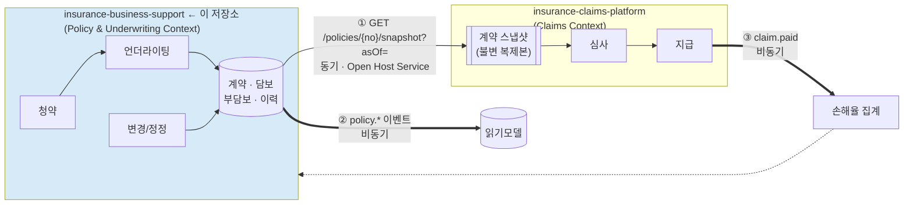

# 01. 컨텍스트 맵 — business-support 관점

> **정본은 `insurance-claims-platform/docs/design/01-context-map.md`다.**
> 이 문서는 같은 경계를 **업스트림(제공자) 관점**에서 다시 서술하고, BS가 지켜야 할 의무를 명시한다.
> 내용이 갈라지면 claims 쪽 문서가 우선한다.

---

## 1. 이 저장소의 위치



**BS는 업스트림이다.** claims를 동기 호출하지 않으며, claims가 없어도 완전히 동작한다.

---

## 2. 업스트림으로서의 의무

BS가 제공하는 스냅샷 API는 **공표된 공용 계약(Open Host Service)**이다.
claims 하나를 위한 편의 API가 아니라, 앞으로 다른 소비자가 붙을 수 있는 공개 인터페이스로 취급한다.

| 의무 | 내용 | 위반 시 |
|---|---|---|
| **시점 재현성** | 같은 `(policyNo, asOf, knownAt)`은 **영원히 같은 응답**을 준다 | 청구 심사 재현 불가 → 분쟁 대응 실패 |
| **하위 호환** | 필드 추가만 자유. 삭제·의미 변경은 새 버전 | claims 파싱 실패 |
| **계약 테스트 통과** | claims가 정의한 계약 픽스처를 CI에서 검증 | **BS 빌드 실패** |
| **최소권한** | 심사에 불필요한 개인정보를 주지 않는다 | 개인정보 과다 제공 |
| **가용성** | 목표 99.9%. 단, 다운돼도 claims 접수는 계속됨 | 심사 지연 |
| **정정 통보** | 소급 정정 시 `policy.corrected` 발행 | claims가 틀린 근거로 계속 지급 |

### 2.1 "영원히 같은 응답"의 의미

```
GET /policies/P2026-0001234/snapshot?asOf=2026-03-14
```

이 요청은 **오늘 호출하든 3년 뒤 호출하든 같은 답**이어야 한다 — 단, 소급 정정이 없었다면.

정정이 있었다면 `snapshotVersion`이 올라가고, `knownAt` 파라미터로 과거 버전을 다시 꺼낼 수 있어야 한다.
이것이 Bitemporal 모델이 필요한 유일하고 충분한 이유다.

---

## 3. 제공 인터페이스 ①: 스냅샷 API

전체 스키마는 [`05-api.md`](05-api.md), 소비자 관점 설명은 claims의 `01-context-map.md` §3~4.

### 3.1 BS가 책임지는 부분

```jsonc
{
  "snapshotId": "PSN-20260402-000123",
  "asOf": "2026-03-14",
  "snapshotVersion": 1,              // ← 정정이 있으면 증가

  "product": { "productCode": "MED-INDEM-G4", "generation": "G4" },
  "policyStatusAsOf": "IN_FORCE",    // ← asOf 시점의 상태 (오늘 상태 아님)
  "policyPeriod": { "from": "2026-01-01", "to": "2031-01-01" },
  "effectiveDate": "2026-01-01",

  "insured": { "insuredRef": "CI-xxxx", "birthYear": 1988, "relationToHolder": "SELF" },

  "coverages": [ /* asOf 시점 유효 담보 + 요율·한도 */ ],
  "exclusions": [ /* asOf 시점 유효 부담보 */ ],
  "premium": { "paidThrough": "2026-03-31", "inGracePeriod": false },

  "checksum": "sha256:9f2c..."       // ← BS가 생성. claims가 재계산 검증
}
```

### 3.2 checksum 생성 규칙

```
checksum = "sha256:" + hex(SHA256(canonicalJson(response - checksum 필드)))
```

`canonicalJson`은 **키 정렬 + 공백 제거**를 적용한 정규화 형태다.
claims가 동일 알고리즘으로 재계산해 대조하므로, 두 레포가 같은 규칙을 쓰는지 계약 테스트로 검증한다.

### 3.3 성능·안정성 요구

| 항목 | 목표 | 수단 |
|---|---|---|
| p99 응답 | < 300ms | 시점 조회 인덱스, Redis 캐시(확정 과거는 영구 캐시 가능) |
| 타임아웃 | claims 측 3초 | — |
| 서킷브레이커 | claims 측 구현 | BS는 빠른 실패를 반환 |

> **과거 `asOf`에 대한 스냅샷은 불변이므로 캐시 만료가 필요 없다.**
> 정정이 발생할 때만 캐시를 무효화한다. 이것이 Bitemporal 모델의 부수적 이득이다.

---

## 4. 제공 인터페이스 ②: 계약 이벤트

| 이벤트 | 발행 시점 | claims의 반응 | 중요도 |
|---|---|---|---|
| `policy.issued` | 계약 성립 | 읽기모델 생성 | 보통 |
| `policy.endorsed` | 현행 변경 | 읽기모델 갱신 | 보통 |
| `policy.lapsed` | 실효 확정 | 읽기모델 갱신 (진행 중 심사 불간섭) | 보통 |
| `policy.reinstated` | 부활 | 읽기모델 갱신 | 보통 |
| `policy.terminated` | 해지·만기 | 읽기모델 갱신 | 보통 |
| **`policy.corrected`** | **소급 정정** | **영향 청구를 재심사 대상 표시** | **높음** |

### 4.1 `policy.corrected`가 특별한 이유

나머지 이벤트는 "오늘부터 이렇게 됐다"는 통보라 이미 확정된 심사에 영향을 주지 않는다.
정정은 **"과거의 사실이 틀렸었다"**는 선언이므로, 그 사실에 근거한 심사가 전부 흔들린다.

```jsonc
// policy.corrected
{
  "policyNo": "P2026-0001234",
  "correctionScope": {
    "validFrom": "2026-01-01",
    "validTo": "2031-01-01",
    "affectedElements": ["EXCLUSION"]      // COVERAGE|EXCLUSION|STATUS|PERIOD
  },
  "previousSnapshotVersion": 1,
  "newSnapshotVersion": 2,
  "reason": "부담보 조건 착오 입력 정정",
  "correctedAt": "2026-05-20T11:00:00+09:00"
}
```

claims는 `correctionScope.validFrom ~ validTo` 구간에 사고일이 걸친 청구를 찾아
**심사자 큐에 올린다.** 자동 재심사하지 않는다 — 정정의 방향에 따라 추가지급일 수도 환수일 수도 있어 사람 판단이 필요하다.

### 4.2 발행 방식

**Transactional Outbox.** 계약 상태 변경과 이벤트 저장이 같은 트랜잭션이다.
상세는 [`04-events-and-integration.md`](04-events-and-integration.md).

---

## 5. 수신 인터페이스 ③: claims 이벤트

BS는 claims의 이벤트를 **참고 목적으로만** 소비한다.

| 이벤트 | 용도 | **하지 않는 것** |
|---|---|---|
| `claim.paid` | 손해율 집계, 갱신 심사 참고, 4세대 비급여 이용량 연동 보험료 산정 | ❌ 계약 상태 자동 변경 |
| `claim.reclaimed` | 환수 통계 | ❌ 자동 조치 |

> **claims 이벤트가 계약을 바꾸지 않는다.** 만약 바꾸면 양방향 의존이 생겨
> "청구 처리 장애 → 계약 업무 마비"가 된다. 통계 테이블에만 적재한다.

---

## 6. 절대 하지 않는 것

| 금지 | 이유 |
|---|---|
| claims를 동기 호출 | 순환 의존. 계약 업무가 보상 장애에 묶임 |
| claims DB 직접 조회 | 컨텍스트 경계 파괴 |
| claims와 DB 공유 | 배포·스키마가 다시 묶임 |
| 공유 DTO 라이브러리 | 컴파일 타임 결합. 계약 테스트로 대체 |
| 과거 레코드 UPDATE/DELETE | 시점 재현성 파괴. **정정도 새 버전 INSERT로 한다** |
| 심사에 개입 | 보상 판단은 claims의 책임 |

---

## 7. 계약 테스트 (소비자 주도)

claims가 "내가 기대하는 응답 형태"를 계약 파일로 선언하고, **BS의 CI가 그것을 검증**한다.

```
insurance-business-support/
└── src/test/resources/contracts/          # claims 레포에서 동기화
    ├── policy-snapshot-response.json
    ├── policy-snapshot-with-exclusion.json
    ├── policy-snapshot-lapsed.json
    └── events/
        ├── policy.issued.json
        └── policy.corrected.json
```

```groovy
// CI에서 실행
task contractTest(type: Test) {
    description 'claims가 정의한 계약을 실제 응답이 만족하는지 검증'
    useJUnitPlatform { includeTags 'contract' }
}
check.dependsOn contractTest
```

**계약을 깨면 BS의 빌드가 실패한다.** claims가 배포된 뒤에 깨지는 것이 아니라, BS의 PR에서 잡힌다.

### 7.1 계약 파일 동기화

초기에는 수동 복사로 충분하다 (두 레포 모두 한 사람이 관리).
규모가 커지면 Pact Broker 같은 도구로 전환한다. **지금은 과한 도구를 들이지 않는다.**

---

## 8. 데이터 소유권

| 데이터 | 원천 | claims의 사본 |
|---|---|---|
| 계약 · 담보 · 부담보 · 요율 · 한도 | **BS** | 스냅샷(불변) + 읽기모델 |
| 피보험자 식별자 | **BS** | 참조만 |
| 고지사항 · 건강진단 결과 | **BS** | ❌ 제공하지 않음 |
| 보험료 수납 상태 | **BS** | 스냅샷 내 요약만 |
| 청구 · 심사 · 지급 | claims | — |
| **한도 소진량** | **claims** | — |

> **한도 소진을 BS가 관리하지 않는 이유**: 계약은 "연간 5천만원까지"를 정의하고,
> "지금까지 3천만원 썼다"는 지급의 결과다. 후자를 BS가 들고 있으면
> 지급 때마다 BS를 동기 갱신해야 하고, 그 순간 양방향 의존이 생긴다.

---

## 9. 장애 시 동작

| 장애 | BS 영향 | claims 영향 |
|---|---|---|
| claims 다운 | **없음** | — |
| Kafka 다운 | 이벤트가 Outbox에 적재, 복구 시 발행 | 읽기모델 지연 (심사는 무관) |
| BS 다운 | 청약·계약 업무 중단 | **접수는 계속됨** (202 + 스냅샷 PENDING) |
| BS DB 지연 | 스냅샷 API 지연 | 서킷브레이커 → 접수 계속 |

**claims 접수를 막지 않는 것이 중요하다.** 보험금 지급기한이 접수일부터 기산되므로,
접수를 거부하면 고객에게 더 불리해진다.

---

## 다음 문서

- [`02-domain-model.md`](02-domain-model.md) — 애그리거트와 Bitemporal 구현
- [`05-api.md`](05-api.md) — 스냅샷 API 전체 명세
- claims: [`01-context-map.md`](https://github.com/hyunolike/insurance-claims-platform/blob/develop/docs/design/01-context-map.md) (정본)
