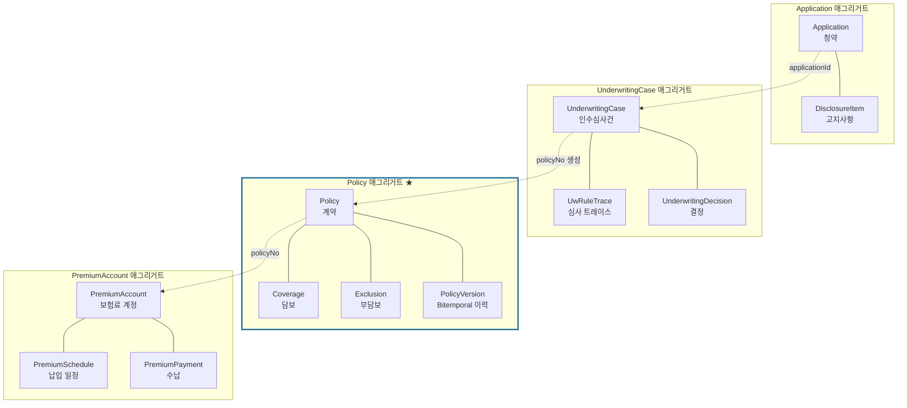

# 02. 도메인 모델 — 계약 · 언더라이팅

> 용어는 [`00-domain-glossary.md`](00-domain-glossary.md)를 따른다.

---

## 1. 애그리거트 식별



| 애그리거트 | 루트 | 불변식의 성격 |
|---|---|---|
| **Application** | `Application` | 청약 1건의 완결성 (고지 누락 없음) |
| **UnderwritingCase** | `UnderwritingCase` | 인수 결정의 원자성 + 트레이스 |
| **Policy** ★ | `Policy` | **시점 재현성** — 이 시스템의 핵심 |
| **PremiumAccount** | `PremiumAccount` | 수납 정합성, 실효 판정 |

**애그리거트 간 참조는 ID로만.**

---

## 2. Policy 애그리거트 ★

이 컨텍스트의 심장이다. 설계의 거의 모든 난이도가 여기 있다.

### 2.1 요구사항

1. 오늘의 계약 상태를 빠르게 조회할 수 있어야 한다
2. **과거 임의 시점의 계약 상태를 재현**할 수 있어야 한다
3. 소급 정정이 있어도 **정정 전에 우리가 알던 것**을 재현할 수 있어야 한다
4. 과거 레코드를 절대 수정·삭제하지 않는다

### 2.2 Bitemporal 구조

```java
public class Policy {                     // 애그리거트 루트
    private PolicyNo policyNo;
    private ProductRef product;           // 상품코드 + 세대
    private PolicyHolderRef holder;
    private InsuredRef insured;
    private PolicyPeriod period;

    /** 시간축을 가진 사실들 */
    private final List<PolicyVersion> versions;   // 상태·기간의 변경 이력
    private final List<Coverage> coverages;       // 각자 valid/recorded 구간 보유
    private final List<Exclusion> exclusions;     // 각자 valid/recorded 구간 보유

    /** ★ 핵심 메서드 */
    public PolicySnapshot snapshotAsOf(LocalDate asOf, Instant knownAt) {
        return new PolicySnapshot(
            policyNo,
            asOf,
            statusAt(asOf, knownAt),
            coveragesAt(asOf, knownAt),
            exclusionsAt(asOf, knownAt),
            versionNumberAt(asOf, knownAt)
        );
    }
}
```

```java
/** 시간축을 가진 모든 엔티티의 공통 구조 */
public interface Temporal {
    LocalDate validFrom();      // 현실에서 유효 시작
    LocalDate validTo();        // 현실에서 유효 종료 (배타적)
    Instant   recordedAt();     // 시스템 기록 시점
    Instant   supersededAt();   // 이 레코드가 대체된 시점 (null = 현행)

    /** 대체한 연산이 정정이었는가. 변경(구간 닫기)이면 false. 스냅샷 버전은 정정만 센다 */
    boolean   supersededByCorrection();

    default boolean isEffectiveOn(LocalDate asOf, Instant knownAt) {
        return !asOf.isBefore(validFrom()) && asOf.isBefore(validTo())
            && !knownAt.isBefore(recordedAt())
            && (supersededAt() == null || knownAt.isBefore(supersededAt()));
    }
}
```

### 2.3 세 가지 변경 연산

**이 구분이 정확해야 시스템이 동작한다.**

| 연산 | 의미 | `valid` 축 | `recorded` 축 | claims 영향 |
|---|---|---|---|---|
| **신규(Create)** | 계약 성립 | 새 구간 시작 | 새 레코드 | `policy.issued` |
| **변경(Endorsement)** | "오늘부터 바뀐다" | 기존 기록 대체 + 닫힌 구간·새 구간 INSERT | `superseded_by_correction=FALSE` | `policy.endorsed` — 과거 스냅샷 불변 |
| **정정(Correction)** | "과거가 원래 그랬다" | 기존 기록 대체 + (대체 기록이 있으면) INSERT | `superseded_by_correction=TRUE` | **`policy.corrected`** — 과거 스냅샷이 바뀜 |

#### 변경 (Endorsement)

```
[기존] 담보 A, valid: 2026-01-01 ~ 9999-12-31, recorded: 2026-01-01, superseded: null
                                ↓ 2026-06-01부터 가입금액 변경 (기록: 2026-05-20)
[대체] 담보 A, valid: 2026-01-01 ~ 9999-12-31, recorded: 2026-01-01,
                     superseded: 2026-05-20, superseded_by_correction: FALSE
[신규] 담보 A, valid: 2026-01-01 ~ 2026-06-01, recorded: 2026-05-20  ← 닫힌 구간
[신규] 담보 A, valid: 2026-06-01 ~ 9999-12-31, recorded: 2026-05-20  ← 새 조건
```

> ⚠️ **기존 행의 `valid_to`를 줄여서 구간을 닫으면 안 된다.**
> 직관적으로는 "구간을 닫는다 = validTo를 당긴다"로 보이지만, 그러면 시점 재현성이 깨진다.
>
> ```
> 변경 전:  query(asOf=2026-07-01, knownAt=2026-05-01) → 담보 A 반환
> 변경 후:  query(asOf=2026-07-01, knownAt=2026-05-01) → 아무것도 없음 ❌
>           · 축소된 구간(01-01~06-01)은 07-01을 덮지 않는다
>           · 새 구간(06-01~)은 recorded=05-20 > knownAt=05-01 이라 걸러진다
> ```
>
> **같은 `(asOf, knownAt)`이 다른 답을 주면 이 시스템은 의미가 없다.**
> 그래서 변경도 정정과 똑같이 "기존 기록 대체 + 새 행"으로 처리한다.
> Phase 1 구현 중 `PolicySnapshotTest`의
> `변경 이전 knownAt으로 미래 날짜를 조회해도 답이 나온다`가 이 문제를 잡아냈다.

**그렇다면 변경과 정정의 차이는 무엇인가**

둘 다 기존 기록을 대체한다. 구분은 `superseded_by_correction` 플래그에 있다.

| | 변경 | 정정 |
|---|---|---|
| `superseded_by_correction` | `FALSE` | `TRUE` |
| 의미 | "이 사실이 언제까지 유효했는지 확정됐다" | "이 사실 자체가 틀렸었다" |
| 과거 스냅샷 내용 | **그대로** | **바뀜** |
| 스냅샷 버전 | 오르지 않음 | **+1** |
| 이벤트 | `policy.endorsed` | **`policy.corrected`** |

스냅샷 버전이 정정만 세는 이유: 변경이 버전을 올리면 claims 쪽에서
"과거가 바뀌었다"고 오해해 불필요한 재심사를 돌리게 된다.

#### 정정 (Correction)

```
[기존] 부담보 척추, valid: 2026-01-01 ~ 2031-01-01, recorded: 2026-01-01, superseded: null
                                ↓ 2026-05-20: 착오였음이 밝혀짐
[수정] 부담보 척추, valid: 2026-01-01 ~ 2031-01-01, recorded: 2026-01-01,
                    superseded: 2026-05-20            ← 무효화
(새 레코드 없음 = 부담보가 애초에 없었던 것으로 정정)

→ asOf=2026-03-14, knownAt=2026-04-02  → 부담보 있음  (4월 심사 재현)
→ asOf=2026-03-14, knownAt=now         → 부담보 없음  (현재 진실)
→ policy.corrected 발행 → claims가 재심사 대상 표시
```

### 2.4 불변식

| # | 불변식 | 강제 방법 |
|---|---|---|
| P1 | 같은 담보의 유효구간이 겹치지 않는다 | DB `EXCLUDE` 제약 (GiST) |
| P2 | `validFrom < validTo` | `CHECK` |
| P3 | **기존 레코드를 `UPDATE`하지 않는다** (단, 대체 마킹 `supersededAt` + `supersededByCorrection`은 예외) | DB 트리거 |
| P4 | `recordedAt`은 단조 증가 | 애플리케이션 |
| P5 | 계약 상태 전이는 전이표를 따른다 | 도메인 메서드 |
| P6 | 책임개시일 = 승낙일과 초회보험료 납입일 중 **늦은 날** | 도메인 규칙 |
| P7 | 부담보는 담보 유효기간 안에서만 존재 | 도메인 검증 |

**P1의 DB 강제**

```sql
ALTER TABLE coverage_version ADD CONSTRAINT no_overlap
EXCLUDE USING gist (
    policy_no  WITH =,
    coverage_code WITH =,
    daterange(valid_from, valid_to) WITH &&
) WHERE (superseded_at IS NULL);
```

> PostgreSQL의 범위 배타 제약으로 **기간 겹침을 DB가 거부한다.**
> 애플리케이션 로직이 틀려도 잘못된 데이터가 들어가지 않는다.

### 2.5 상태 전이

[`00-domain-glossary.md`](00-domain-glossary.md) §2.2의 전이도를 코드의 전이표로 구현한다.

```java
public final class PolicyTransitions {
    private static final Map<PolicyStatus, Set<PolicyStatus>> ALLOWED = Map.of(
        APPLIED,      Set.of(UNDERWRITING, CANCELLED),
        UNDERWRITING, Set.of(IN_FORCE, DECLINED),
        IN_FORCE,     Set.of(GRACE, SURRENDERED, MATURED, CANCELLED),
        GRACE,        Set.of(IN_FORCE, LAPSED),
        LAPSED,       Set.of(REINSTATED, SURRENDERED),
        REINSTATED,   Set.of(IN_FORCE),
        DECLINED,     Set.of(),
        SURRENDERED,  Set.of(),
        MATURED,      Set.of(),
        CANCELLED,    Set.of()
    );
}
```

전이 위반은 `IllegalPolicyTransitionException` → **HTTP 409**. (500이 아니다)

### 2.6 부활(Reinstatement)의 특수성

부활은 단순 상태 복귀가 아니다.

```java
public void reinstate(ReinstatementRequest req, Instant now) {
    ensureStatus(LAPSED);
    ensureWithinReinstatementWindow(req.requestedAt());   // 실효 후 3년 등
    ensureArrearsPaid(req.paidArrears());                 // 연체보험료 + 이자

    // ★ 재고지 + 재심사 결과가 반영된다
    req.newExclusions().forEach(this::addExclusion);      // 새 부담보 가능

    // ★ 면책기간 재기산 — claims 판정에 직결
    this.coverages.forEach(c -> c.resetWaitingPeriod(req.reinstatedOn()));

    transitionTo(REINSTATED, req.reinstatedOn(), now);
    record(new PolicyReinstated(policyNo, req.reinstatedOn(), newWaitingPeriodEnds()));
}
```

> **면책기간 재기산을 빠뜨리면 claims가 틀린 판정을 한다.**
> 부활 직후 사고인데 면책기간이 이미 지난 것으로 계산되어 부당 지급이 발생한다.

---

## 3. Application 애그리거트

```java
public class Application {
    private ApplicationNo applicationNo;
    private ApplicationStatus status;      // DRAFT|SUBMITTED|UNDERWRITING|ACCEPTED|DECLINED|WITHDRAWN
    private ProductRef product;
    private PolicyHolderRef holder;
    private InsuredInfo insured;           // 생년·성별·직업급수 (심사 입력)
    private List<CoverageRequest> requestedCoverages;
    private List<DisclosureItem> disclosures;   // 🔒 암호화 저장
    private CoolingOffPeriod coolingOff;
}
```

### 3.1 불변식

| # | 불변식 |
|---|---|
| A1 | 필수 고지항목이 모두 답변되어야 제출 가능 |
| A2 | 최소 1개 담보를 신청해야 함 |
| A3 | 피보험자 연령이 상품 가입연령 범위 내 |
| A4 | 제출 후 고지사항 수정 불가 (수정하려면 철회 후 재청약) |
| A5 | 청약철회 기간 내에는 무조건 철회 가능 |

### 3.2 고지사항

```java
public record DisclosureItem(
    DisclosureCode code,       // DSC-3M-TREATMENT, DSC-5Y-HOSPITAL ...
    boolean answered,
    boolean hasIssue,          // "예"로 답한 항목
    EncryptedText detail       // 🔒 상세 내용 (질병명, 시기 등)
) {}
```

**`detail`은 민감 건강정보다.** 암호화 저장하고, **스냅샷 API로 claims에 제공하지 않는다.**
claims가 필요한 것은 고지 내용이 아니라 그 **결과물인 부담보 조건**이다.

---

## 4. UnderwritingCase 애그리거트

```java
public class UnderwritingCase {
    private UwCaseNo caseNo;
    private ApplicationNo applicationNo;
    private UwMode mode;                   // AUTO | MANUAL
    private UwStatus status;               // SCREENING|REFERRED|MEDICAL_REQUIRED|
                                           // INVESTIGATION|DECIDED
    private UnderwritingDecision decision; // STANDARD|RATED|EXCLUDED|REDUCED|POSTPONED|DECLINED
    private List<ProposedExclusion> proposedExclusions;
    private RatingFactor ratingFactor;     // 할증률
    private List<UwRuleTrace> traces;      // ★ append-only
    private UnderwriterRef underwriter;
    private String rulesetVersion;
}
```

### 4.1 심사 트레이스 — claims와 같은 원칙

```jsonc
{
  "seq": 5,
  "ruleId": "U-DSC-020",
  "ruleName": "5년 내 입원 이력 확인",
  "input":  { "disclosureCode": "DSC-5Y-HOSPITAL", "hasIssue": true, "category": "MUSCULOSKELETAL" },
  "output": { "action": "PROPOSE_EXCLUSION", "bodyPart": "척추", "kcdRanges": ["M40-M54"], "years": 5 },
  "verdict": "APPLIED"
}
```

**왜 부담보가 붙었는지 설명할 수 있어야 한다.**
고객이 "왜 내 척추는 보장이 안 되나"라고 물을 때 답할 근거이고,
나중에 claims가 부지급했을 때 그 뿌리를 추적하는 경로다.

`uw_rule_trace`도 **append-only**이며 DB 권한으로 `UPDATE`/`DELETE`를 막는다.

### 4.2 인수 결정 → 계약 반영

```java
// 인수 결정이 계약의 부담보로 변환되는 지점
public Policy issue(UnderwritingCase uwCase, LocalDate effectiveDate, Instant now) {
    Policy policy = Policy.create(...);
    uwCase.proposedExclusions().forEach(pe ->
        policy.addExclusion(new Exclusion(
            pe.type(),                    // BODY_PART | DISEASE | KCD_RANGE
            pe.target(),
            pe.kcdRanges(),
            effectiveDate,
            pe.isPermanent() ? policy.period().to() : effectiveDate.plusYears(pe.years()),
            "언더라이팅 부담보 (" + uwCase.caseNo() + ")",   // ← 추적 가능
            now
        ))
    );
    return policy;
}
```

> **`Exclusion`에 `uwCaseNo`를 남긴다.** claims가 부담보로 부지급했을 때
> "이 부담보는 2026-01-01 인수심사 U-2026-0012에서 5년 내 입원 이력으로 부과됨"까지 역추적된다.

---

## 5. PremiumAccount 애그리거트

```java
public class PremiumAccount {
    private PolicyNo policyNo;
    private PaymentCycle cycle;            // MONTHLY|QUARTERLY|ANNUAL|LUMP_SUM
    private Money premiumAmount;
    private LocalDate paidThrough;         // 이 날까지 수납 완료
    private LocalDate nextDueDate;
    private GraceStatus graceStatus;
    private List<PremiumPayment> payments;
}
```

### 5.1 실효 판정

```java
public LapseEvaluation evaluate(LocalDate today, GracePolicy gracePolicy) {
    if (!today.isAfter(nextDueDate)) return LapseEvaluation.normal();

    LocalDate graceEnd = gracePolicy.graceEndFor(nextDueDate);   // 예: 납입기일 + 2개월
    if (today.isBefore(graceEnd)) {
        return LapseEvaluation.grace(graceEnd, demandRequired(today));
    }
    return LapseEvaluation.lapse(graceEnd);
}
```

**납입최고(독촉) 절차를 거치지 않은 실효는 무효가 될 수 있다.**
최고 발송 이력을 반드시 기록하고, 발송 없이 `LAPSED` 전환을 허용하지 않는다.

```java
private boolean canLapse() {
    return demandNotices.stream()
        .anyMatch(n -> n.sentAt() != null && n.noticePeriodSatisfied());
}
```

### 5.2 `paidThrough`가 스냅샷에 실리는 이유

claims가 `GRACE` 상태를 판정하고 **미납보험료 상계** 여부를 검토하려면 수납 시점이 필요하다.
금액이 아니라 **날짜와 유예 여부만** 제공한다 (최소권한).

---

## 6. 도메인 이벤트

claims와 동일한 패턴: **애그리거트가 `record()`, 애플리케이션이 `pullEvents()` → Outbox.**

```java
public class Policy extends AggregateRoot {
    public void correctExclusion(ExclusionCorrection c, Instant now) {
        Exclusion target = findExclusion(c.exclusionId());
        target.supersede(now);                       // UPDATE 아님. 무효화 마킹
        if (c.replacement() != null) {
            exclusions.add(c.replacement().recordedAt(now));
        }
        record(new PolicyCorrected(                  // ★ claims의 재심사를 유발
            policyNo,
            new CorrectionScope(target.validFrom(), target.validTo(), List.of("EXCLUSION")),
            currentSnapshotVersion(), currentSnapshotVersion() + 1,
            c.reason(), now
        ));
    }
}
```

**`@Transactional` 안에서 외부 발행을 하지 않는다.** Outbox 테이블 INSERT만 한다.

---

## 7. 값 객체

| VO | 불변식 |
|---|---|
| `PolicyNo` | `P{YYYY}-{NNNNNNN}` — DB 시퀀스 |
| `Money` | 음수 불가, **KRW 원 단위 정수** |
| `PolicyPeriod` | `from < to`, 상품별 최대 기간 검증 |
| `CoinsuranceRate` | 0.0~1.0, `BigDecimal` (`double` 금지) |
| `KcdRange` | `from <= to`, KCD 형식 검증 |
| `OccupationClass` | 1~3급 |
| `InsuredRef` | CI 또는 내부 고객키. **주민번호 아님** |
| `EncryptedText` | 암호문 보유, `toString()`은 `"***"` |

---

## 8. 포트

```java
public interface PolicyNumberGenerator { PolicyNo next(int year); }

public interface ProductCatalogPort {              // 상품 마스터
    ProductSpec find(ProductCode code, LocalDate asOf);
}

public interface PremiumCalculationPort {          // 요율 계산
    Money calculate(ProductCode code, InsuredInfo insured,
                    List<CoverageRequest> coverages, RatingFactor rating);
}

public interface MedicalExamPort { ... }           // 건강진단 (스텁)
public interface FieldInvestigationPort { ... }    // 적부조사 (스텁)
public interface CreditInfoPort { ... }            // 신용정보원 조회 (스텁)
public interface NotificationPort { ... }          // 최고장·안내 (스텁)
```

---

## 9. 의도적으로 하지 않은 것

| 안 한 것 | 이유 |
|---|---|
| 이벤트 소싱 | Bitemporal 테이블로 이력 요구가 충족된다. 이중 복잡도 회피 |
| 상품 개발·요율 산출 | 계리 영역. 상품 마스터를 **주어진 데이터**로 취급 |
| 설계사·수수료 | 별도 도메인 |
| 실제 수납 연동(CMS/PG) | 포트 + 스텁 |
| claims의 한도 원장 | 보상 사실. claims 소유 |

---

## 다음 문서

- [`03-underwriting.md`](03-underwriting.md) — 언더라이팅 룰 카탈로그
- [`06-data-model.md`](06-data-model.md) — Bitemporal 스키마
