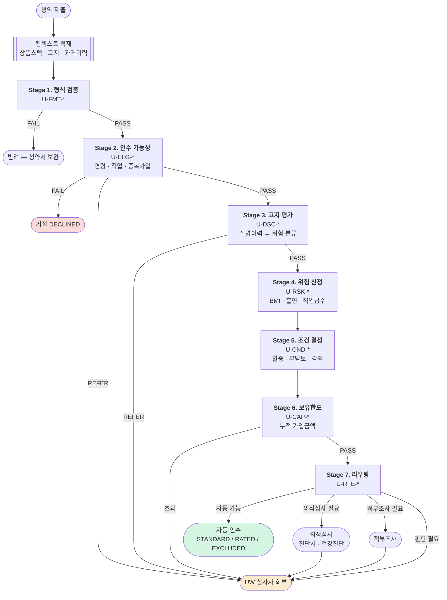

# 03. 언더라이팅 — 룰 카탈로그와 인수 결정

> ⚠️ 이 문서의 수치(연령 한도, 직업급수, 할증률, 부담보 기간)는 **설계 예시**다.
> 실제 인수 기준은 보험사 내부 규정·재보험사 매뉴얼로 정해지며, 코드가 아니라 **설정 데이터**로 관리한다.

---

## 1. 설계 원칙

claims의 심사 엔진과 **같은 원칙**을 쓴다. 두 시스템이 같은 방식으로 동작해야 이해와 운영이 쉽다.

| 원칙 | 이유 |
|---|---|
| 모든 룰이 근거를 남긴다 | "왜 내 척추가 부담보인가"에 답해야 한다 |
| 룰은 순수 함수 | `(입력) → (판정, 근거)`. I/O는 파이프라인 밖 |
| 파라미터는 데이터, 로직은 코드 | 인수 기준은 자주 바뀐다 |
| **애매하면 거절이 아니라 회부** | 자동 거절의 오탐은 영업 손실 + 민원 |
| 룰셋 버전 기록 | 재현 가능성 |

### 1.1 claims와의 결정적 차이

| | claims 심사 | 언더라이팅 |
|---|---|---|
| 틀렸을 때 | **법적 책임 + 지연이자** | 영업 기회 손실 |
| 오탐 비용 | 부당 부지급 → 민원·분쟁 | 부당 거절 → 고객 이탈 |
| 자동화 목표 | 정확성 우선 | 속도 우선 (가입 이탈 방지) |
| 회부 기준 | 보수적 (의심되면 회부) | 균형 (너무 자주 회부하면 가입이 끊긴다) |

**언더라이팅은 빠른 것이 가치다.** 청약 중 심사가 며칠 걸리면 고객이 이탈한다.
그래서 표준체 건은 초 단위로 자동 인수하고, 위험 신호가 있을 때만 사람이 본다.

---

## 2. 파이프라인



---

## 3. 룰 카탈로그

룰 ID 규칙: `U-{단계}-{번호}`

### Stage 1. 형식 검증 `U-FMT-*`

| ID | 룰 | 실패 시 |
|---|---|---|
| `U-FMT-010` | 필수 고지항목 전건 답변 | 반려 |
| `U-FMT-020` | 최소 1개 담보 신청 | 반려 |
| `U-FMT-030` | 계약자·피보험자 관계 유효성 | 반려 |
| `U-FMT-040` | 미성년 피보험자 시 친권자 동의 | 반려 |
| `U-FMT-050` | 계약자 ≠ 피보험자일 때 피보험자 서면동의 | 반려 |

> `U-FMT-050`은 **상법상 요건**이다. 누락 시 계약이 무효가 될 수 있어 형식 단계에서 막는다.

### Stage 2. 인수 가능성 `U-ELG-*`

| ID | 룰 | 판정 | 결과 |
|---|---|---|---|
| `U-ELG-010` | 상품 가입연령 범위 | 벗어남 | `DECLINED` |
| `U-ELG-020` | 직업급수 인수 가능 범위 | 3급 초과 | `DECLINED` 또는 `REFER` |
| `U-ELG-030` | 동일 보험사 실손 중복가입 | 존재 | **`REFER`** — 실손은 중복가입 실익이 없음 |
| `U-ELG-040` | 타사 실손 가입 (고지 기준) | 존재 | `REFER` — 비례보상 안내 필요 |
| `U-ELG-050` | 과거 거절·부담보 이력 | 존재 | `REFER` |
| `U-ELG-060` | 최근 청약 반복 (역선택 신호) | N회 초과 | `REFER` |

### Stage 3. 고지 평가 `U-DSC-*`

**언더라이팅의 핵심.** 고지된 질병 이력을 **위험 카테고리**로 분류하고 대응을 정한다.

| ID | 고지 항목 | 기본 대응 |
|---|---|---|
| `U-DSC-010` | 3개월 내 진찰·검사·투약 | 경증이면 통과, 중증 신호면 `REFER` |
| `U-DSC-020` | 1년 내 추가검사(재검사) | **`REFER`** — 확정진단 전 상태라 위험 평가 불가 |
| `U-DSC-030` | 5년 내 입원·수술 | 부위별 **부담보 제안** |
| `U-DSC-040` | 5년 내 계속치료·계속투약 | 질환별 **할증 또는 부담보** |
| `U-DSC-050` | 10대 중대질병 이력 | **`REFER`** 또는 `DECLINED` |
| `U-DSC-060` | 정신질환 이력 | `REFER` |
| `U-DSC-070` | 고지 "예" 항목 N개 초과 | `REFER` (복합 위험) |

#### 질병 → 부담보 매핑

```
고지 내용            → 위험 카테고리      → 부담보 대상 KCD      → 기간
────────────────────────────────────────────────────────────────
추간판탈출증 수술     → MUSCULOSKELETAL   → M40-M54 (척추)      → 5년
담낭절제술           → DIGESTIVE         → K80-K87 (담도·췌장)  → 5년
갑상선 결절 추적관찰  → ENDOCRINE         → E00-E07 (갑상선)     → 5년
자궁근종            → GENITOURINARY     → D25, N80-N98        → 5년
```

이 매핑은 **`uw_exclusion_mapping` 테이블**로 관리한다. 코드에 두지 않는다.

```sql
CREATE TABLE uw_exclusion_mapping (
    ruleset_version VARCHAR(16) NOT NULL,
    risk_category   VARCHAR(32) NOT NULL,
    disclosure_code VARCHAR(32) NOT NULL,
    severity        VARCHAR(16) NOT NULL,    -- MILD | MODERATE | SEVERE
    action          VARCHAR(24) NOT NULL,    -- PASS|EXCLUDE|RATE|REFER|DECLINE
    kcd_ranges      TEXT[]      NULL,
    exclusion_years INT         NULL,        -- NULL = 전기간
    rating_percent  INT         NULL,
    clause          VARCHAR(256) NULL,
    PRIMARY KEY (ruleset_version, disclosure_code, risk_category, severity)
);
```

### Stage 4. 위험 산정 `U-RSK-*`

| ID | 요소 | 산정 |
|---|---|---|
| `U-RSK-010` | BMI | 정상 범위 밖이면 할증 점수 |
| `U-RSK-020` | 흡연 | 흡연자 할증 |
| `U-RSK-030` | 직업급수 | 2급·3급 할증 |
| `U-RSK-040` | 위험 취미 (등반·스쿠버 등) | 할증 또는 부담보 |
| `U-RSK-050` | 연령대 | 상품 요율에 반영 |
| `U-RSK-100` | **종합 위험점수 산출** | 다음 단계 입력 |

### Stage 5. 조건 결정 `U-CND-*`

| ID | 조건 | 결정 |
|---|---|---|
| `U-CND-010` | 위험점수 ≤ 표준 임계 | `STANDARD` |
| `U-CND-020` | 위험점수 초과, 부담보로 해소 가능 | `EXCLUDED` |
| `U-CND-030` | 위험점수 초과, 할증으로 해소 가능 | `RATED` |
| `U-CND-040` | 부담보 + 할증 병행 | `EXCLUDED` + `RATED` |
| `U-CND-050` | 가입금액 축소 필요 | `REDUCED` |
| `U-CND-060` | 현재 판단 불가, 경과 관찰 필요 | `POSTPONED` |
| `U-CND-070` | 인수 불가 | `DECLINED` |
| `U-CND-080` | **부담보 개수 N개 초과** | `REFER` — 상품 가치가 훼손됨 |

> `U-CND-080`이 중요하다. 부담보를 5개, 6개씩 붙이면 고객이 받는 보장이 거의 없어진다.
> **"인수는 했지만 쓸모없는 계약"은 불완전판매 리스크**다. 사람이 판단해야 한다.

### Stage 6. 보유한도 `U-CAP-*`

| ID | 룰 | 결과 |
|---|---|---|
| `U-CAP-010` | 동일 피보험자 자사 누적 가입금액 | 한도 초과 시 `REFER` |
| `U-CAP-020` | 보유한도 초과분 재보험 출재 필요 | `REFER` |
| `U-CAP-030` | 고액 계약 | `REFER` (결재선 상향) |

### Stage 7. 라우팅 `U-RTE-*`

| ID | 조건 | 결과 |
|---|---|---|
| `U-RTE-010` | 앞 단계 `REFER` 1건 이상 | UW 회부 |
| `U-RTE-020` | 고지 중증 신호 + 고액 | **의적심사** (진단서 징구) |
| `U-RTE-030` | 연령·금액이 건강진단 기준 초과 | **건강진단** |
| `U-RTE-040` | 역선택 의심 (계약 직후 청구 패턴 등) | **적부조사** |
| `U-RTE-050` | 위 전부 해당 없음 | **자동 인수** |

---

## 4. 인수 결정 워크스루

### 예시 1 — 표준체 자동 인수

```
청약: 35세 남성, 사무직(1급), 4세대 실손, 고지 전건 "아니오"

[Stage 1] 형식 OK
[Stage 2] 연령 범위 내, 1급, 중복가입 없음 → PASS
[Stage 3] 고지 이슈 0건 → PASS
[Stage 4] BMI 22.5(정상), 비흡연, 1급 → 위험점수 0
[Stage 5] U-CND-010 → STANDARD
[Stage 6] 누적 가입금액 한도 내
[Stage 7] U-RTE-050 → 자동 인수

━━━━━━━━━━━━━━━━━━━━━━━━━━━━━
결정: STANDARD (표준체 인수)
소요: < 1초, 사람 개입 없음
→ policy.issued 발행
```

### 예시 2 — 부담보 인수 (claims까지 이어지는 케이스)

```
청약: 42세 여성, 사무직, 4세대 실손
고지: "5년 내 입원·수술" = 예 → 2024년 요추 추간판탈출증 수술

[Stage 3] U-DSC-030
  disclosureCode = DSC-5Y-SURGERY
  riskCategory   = MUSCULOSKELETAL
  severity       = MODERATE
  → 매핑 조회: action=EXCLUDE, kcdRanges=[M40-M54], years=5

[Stage 5] U-CND-020 → EXCLUDED
  제안 부담보: 척추 및 그 부속기관, M40-M54, 5년

[Stage 7] 부담보 1개, 고액 아님 → 자동 인수

━━━━━━━━━━━━━━━━━━━━━━━━━━━━━
결정: EXCLUDED
계약 성립 시 Exclusion 생성:
  { type: BODY_PART, target: "척추 및 그 부속기관",
    kcdRanges: ["M40-M54"],
    from: 2026-01-01, until: 2031-01-01,
    reason: "언더라이팅 부담보", uwCaseNo: "U-2026-0012" }
```

**이 부담보가 2년 뒤 claims에서 이렇게 작동한다:**

```
2028-05-10  진료, 주상병 M51.2 (요추 추간판 장애)
claims [Stage 2] R-POL-050: M51.2 ∈ M40-M54 && 진료일 ∈ 부담보 기간
→ DENIED: D-POL-004 (부담보 조건에 해당)
→ 역추적: Exclusion.uwCaseNo = U-2026-0012
        → UwRuleTrace: "5년 내 입원 이력(요추 추간판탈출증 수술)로 부과"
```

**청약 시점의 판단이 청구 시점의 부지급 근거까지 끊기지 않고 연결된다.**
이것이 두 레포를 하나의 시스템으로 설계한 이유다.

### 예시 3 — 회부

```
청약: 51세 남성, 고지: "1년 내 추가검사" = 예 → 폐 결절 추적관찰 중

[Stage 3] U-DSC-020 → REFER
  이유: 확정진단 전. 양성/악성 판별 안 됨 → 위험 평가 불가

[Stage 7] U-RTE-020 → 의적심사 (진단서 징구)

━━━━━━━━━━━━━━━━━━━━━━━━━━━━━
결정: 보류 → MEDICAL_REQUIRED
UW 심사자 큐 + 고객에게 진단서 요청 안내
```

---

## 5. UW 심사자 인터페이스

### 5.1 제공해야 하는 것

| 항목 | 이유 |
|---|---|
| 회부 사유 (룰 ID + 설명) | 무엇을 봐야 하는지 |
| 고지사항 전체 (복호화) | 판단 근거 |
| 자동 룰이 제안한 조건 | 기준점 |
| 룰 트레이스 | 어떻게 그 제안이 나왔는지 |
| 과거 청약·거절 이력 | 역선택 판단 |
| 상품 스펙 | 인수 가능 범위 |

### 5.2 결정 시 필수 입력

- 결정 (`STANDARD`/`RATED`/`EXCLUDED`/`REDUCED`/`POSTPONED`/`DECLINED`)
- 자동 제안과 다르면 **`overrideReason` 필수**
- `EXCLUDED`면 부담보 대상·KCD 범위·기간 필수
- `DECLINED`면 거절 사유코드 필수
- 심사자 ID·시각 자동 기록, `MANUAL_OVERRIDE` 트레이스 추가

### 5.3 고객 통지 의무

| 결정 | 통지 내용 |
|---|---|
| `EXCLUDED` | **부담보 부위·기간을 명확히 안내 + 동의 확인** |
| `RATED` | 할증 보험료 안내 + 동의 확인 |
| `DECLINED` | 거절 사실 안내 |
| `POSTPONED` | 재청약 가능 시기 안내 |

> **부담보 인수는 고객 동의가 필요하다.** 동의 없이 계약을 성립시키면 불완전판매다.
> 시스템은 **동의 기록 없이 `policy.issued`로 넘어가지 못하게** 막는다.

```java
public Policy issue(UnderwritingCase uwCase, ConsentRecord consent, ...) {
    if (uwCase.decision().requiresConsent() && !consent.isValidFor(uwCase)) {
        throw new ConsentRequiredException(uwCase.caseNo());
    }
    ...
}
```

---

## 6. 룰셋 버저닝과 골든 케이스

claims와 동일한 방식이다.

```
src/test/resources/golden/uw/2026.01/
├── case-001-standard-accept.json       ← 예시 1
├── case-002-exclusion-spine.json       ← 예시 2
├── case-003-refer-medical.json         ← 예시 3
├── case-004-decline-age.json
└── case-005-multiple-exclusions.json   ← U-CND-080 회부
```

각 파일: `{ context, expectedDecision, expectedExclusions, expectedTraceRuleIds }`

**룰 변경 시 골든 케이스가 깨지면 의도한 변경인지 검토한다.**

### 6.1 레포 간 골든 케이스 (E2E)

두 시스템이 이어지는 시나리오를 별도로 관리한다.

```
예시 2의 부담보 계약 → claims에서 M51.2 청구 → D-POL-004 부지급
```

Phase 5 완료 시점에 이 E2E 테스트가 통과해야 한다.

---

## 7. 측정 지표

| 지표 | 의미 |
|---|---|
| `uw.auto_rate` | 자동 인수 비율 — 높을수록 좋음 |
| `uw.refer{ruleId}` | **회부 사유별 비중** — 개선 우선순위 |
| `uw.decision{type}` | 결정 분포 |
| `uw.duration` | 청약~결정 소요 (고객 이탈과 직결) |
| `uw.override_rate` | 심사자가 자동 제안을 바꾼 비율 — **높으면 룰이 틀린 것** |

> `uw.override_rate`가 가장 유용한 지표다.
> 심사자가 자동 제안을 자주 뒤집는다면 룰이 현실과 어긋나 있다는 뜻이고, 그 룰부터 고친다.

---

## 8. 자동화율 기대치

| 구간 | 예상 비중 |
|---|---|
| 자동 인수 (표준체) | 60~70% |
| 자동 인수 (부담보·할증) | 10~15% |
| 회부 (의적·적부·판단) | 15~25% |
| 자동 거절 | 2~5% |

> 근거 없는 목표 숫자를 적지 않는다. **회부 사유별 비중을 측정해 상위부터 개선**한다.

---

## 다음 문서

- [`04-events-and-integration.md`](04-events-and-integration.md) — 이벤트와 Outbox
- [`05-api.md`](05-api.md) — 스냅샷 API 명세
