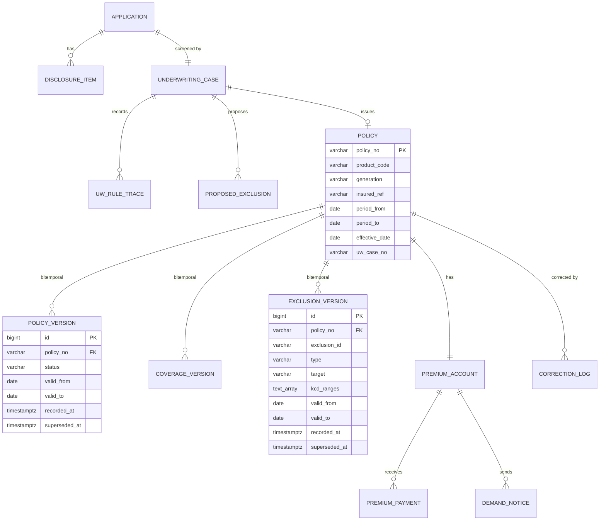

# 06. 데이터 모델 — business-support

DB: PostgreSQL 15 / 마이그레이션: Flyway
**claims와 스키마가 완전히 분리된다.** 크로스 스키마 조인·FK 없음.

---

## 1. 설계의 중심 — Bitemporal

이 스키마의 거의 모든 난이도는 **"과거를 재현한다"**는 요구에서 나온다.

```
유효시간 (valid_from / valid_to)     ← 현실에서 유효했던 기간.  질문: "사고일에 어땠나?"
기록시간 (recorded_at / superseded_at) ← 시스템이 알고 있던 기간. 질문: "그때 우리는 뭘 알았나?"
```

**핵심 규칙: 기존 행을 `UPDATE`하지 않는다.**
변경은 새 행 INSERT, 정정은 기존 행에 `superseded_at`만 찍고 새 행 INSERT.

---

## 2. ERD



---

## 3. 계약 테이블

### 3.1 `policy` — 불변 식별 정보만

```sql
CREATE TABLE policy (
    policy_no       VARCHAR(24)  PRIMARY KEY,
    product_code    VARCHAR(32)  NOT NULL,
    generation      VARCHAR(8)   NOT NULL,          -- G1..G4
    holder_ref      VARCHAR(64)  NOT NULL,
    insured_ref     VARCHAR(64)  NOT NULL,          -- CI/내부키. 주민번호 아님
    period_from     DATE         NOT NULL,
    period_to       DATE         NOT NULL,
    effective_date  DATE         NOT NULL,          -- 책임개시일
    application_no  VARCHAR(24)  NOT NULL,
    uw_case_no      VARCHAR(24)  NOT NULL,
    created_at      TIMESTAMPTZ  NOT NULL DEFAULT NOW()
);

CREATE INDEX idx_policy_insured ON policy (insured_ref);
```

> **변하는 것은 여기 두지 않는다.** 상태·담보·부담보는 전부 버전 테이블로 간다.
> 이 테이블은 계약의 "정체성"만 보유하며 사실상 불변이다.

### 3.2 `policy_version` — 상태 이력

```sql
CREATE TABLE policy_version (
    id            BIGSERIAL    PRIMARY KEY,
    policy_no     VARCHAR(24)  NOT NULL REFERENCES policy(policy_no),
    status        VARCHAR(16)  NOT NULL,
    valid_from    DATE         NOT NULL,
    valid_to      DATE         NOT NULL DEFAULT '9999-12-31',
    recorded_at   TIMESTAMPTZ  NOT NULL DEFAULT NOW(),
    superseded_at TIMESTAMPTZ  NULL,
    change_type   VARCHAR(16)  NOT NULL,    -- CREATE | ENDORSEMENT | CORRECTION
    reason        TEXT         NULL,
    actor_ref     VARCHAR(64)  NOT NULL,
    CHECK (valid_from < valid_to)
);

-- ★ 유효한 레코드끼리 기간이 겹치지 않음
ALTER TABLE policy_version ADD CONSTRAINT policy_version_no_overlap
EXCLUDE USING gist (
    policy_no WITH =,
    daterange(valid_from, valid_to) WITH &&
) WHERE (superseded_at IS NULL);

CREATE INDEX idx_policy_version_asof ON policy_version
    (policy_no, valid_from, valid_to, recorded_at);
```

### 3.3 `coverage_version` — 담보 이력

```sql
CREATE TABLE coverage_version (
    id                  BIGSERIAL    PRIMARY KEY,
    policy_no           VARCHAR(24)  NOT NULL REFERENCES policy(policy_no),
    coverage_code       VARCHAR(32)  NOT NULL,
    coverage_name       VARCHAR(100) NOT NULL,
    benefit_category    VARCHAR(20)  NOT NULL,   -- COVERED|UNCOVERED|MAJOR_UNCOVERED
    treatment_types     TEXT[]       NOT NULL,   -- {INPATIENT,OUTPATIENT,PRESCRIPTION}
    insured_amount      BIGINT       NOT NULL,   -- 원 단위 정수

    coinsurance_rate    NUMERIC(5,4) NOT NULL,
    min_deductible      BIGINT       NULL,       -- NULL = 미적용(입원)
    min_deductible_by_grade JSONB    NULL,       -- 통원 기관종별 차등
    annual_limit        BIGINT       NULL,
    per_visit_limit     BIGINT       NULL,
    annual_count_limit  INT          NULL,
    waiting_period_end  DATE         NULL,

    valid_from          DATE         NOT NULL,
    valid_to            DATE         NOT NULL DEFAULT '9999-12-31',
    recorded_at         TIMESTAMPTZ  NOT NULL DEFAULT NOW(),
    superseded_at       TIMESTAMPTZ  NULL,
    change_type         VARCHAR(16)  NOT NULL,
    CHECK (valid_from < valid_to),
    CHECK (coinsurance_rate >= 0 AND coinsurance_rate <= 1)
);

ALTER TABLE coverage_version ADD CONSTRAINT coverage_no_overlap
EXCLUDE USING gist (
    policy_no     WITH =,
    coverage_code WITH =,
    daterange(valid_from, valid_to) WITH &&
) WHERE (superseded_at IS NULL);
```

> `EXCLUDE USING gist`가 **기간 겹침을 DB가 거부**한다.
> 애플리케이션 로직이 틀려도 모순된 이력이 생기지 않는다. `btree_gist` 확장이 필요하다.

### 3.4 `exclusion_version` — 부담보 이력 ★

**claims의 부지급 판정에 직결되는 테이블.**

```sql
CREATE TABLE exclusion_version (
    id            BIGSERIAL    PRIMARY KEY,
    policy_no     VARCHAR(24)  NOT NULL REFERENCES policy(policy_no),
    exclusion_id  VARCHAR(24)  NOT NULL,          -- 논리 식별자 (버전 간 동일)
    type          VARCHAR(16)  NOT NULL,          -- BODY_PART|DISEASE|KCD_RANGE
    target        VARCHAR(200) NOT NULL,
    kcd_ranges    TEXT[]       NOT NULL,          -- {'M40-M54'}
    reason        VARCHAR(200) NOT NULL,
    uw_case_no    VARCHAR(24)  NULL,              -- ★ 역추적 경로

    valid_from    DATE         NOT NULL,
    valid_to      DATE         NOT NULL,
    recorded_at   TIMESTAMPTZ  NOT NULL DEFAULT NOW(),
    superseded_at TIMESTAMPTZ  NULL,
    change_type   VARCHAR(16)  NOT NULL,
    CHECK (valid_from < valid_to)
);

CREATE INDEX idx_exclusion_asof ON exclusion_version
    (policy_no, valid_from, valid_to, recorded_at)
    WHERE superseded_at IS NULL;

CREATE INDEX idx_exclusion_kcd ON exclusion_version USING gin (kcd_ranges);
```

> **`uw_case_no`가 중요하다.** claims가 부담보로 부지급했을 때
> `Exclusion → UnderwritingCase → UwRuleTrace → DisclosureItem`까지 역추적된다.
> "왜 이 부위가 보장 안 되나"에 뿌리까지 답할 수 있다.

### 3.5 시점 조회 쿼리

```sql
-- asOf 시점 + knownAt 시점의 부담보
SELECT *
FROM exclusion_version
WHERE policy_no = :policyNo
  AND valid_from <= :asOf AND :asOf < valid_to        -- 유효시간
  AND recorded_at <= :knownAt                          -- 기록시간
  AND (superseded_at IS NULL OR superseded_at > :knownAt);
```

`knownAt`을 생략하면 `now()`가 들어가 "지금 아는 최신 사실"이 된다.

**뷰로 감싸 실수를 줄인다.**

```sql
CREATE FUNCTION exclusions_as_of(p_policy_no VARCHAR, p_as_of DATE, p_known_at TIMESTAMPTZ)
RETURNS SETOF exclusion_version AS $$
    SELECT * FROM exclusion_version
    WHERE policy_no = p_policy_no
      AND valid_from <= p_as_of AND p_as_of < valid_to
      AND recorded_at <= p_known_at
      AND (superseded_at IS NULL OR superseded_at > p_known_at);
$$ LANGUAGE sql STABLE;
```

### 3.6 `correction_log` — 정정 이력

```sql
CREATE TABLE correction_log (
    id                BIGSERIAL    PRIMARY KEY,
    policy_no         VARCHAR(24)  NOT NULL REFERENCES policy(policy_no),
    correction_type   VARCHAR(32)  NOT NULL,
    affected_elements TEXT[]       NOT NULL,      -- {COVERAGE,EXCLUSION,STATUS,PERIOD}
    scope_valid_from  DATE         NOT NULL,
    scope_valid_to    DATE         NOT NULL,
    previous_version  INT          NOT NULL,
    new_version       INT          NOT NULL,
    reason            TEXT         NOT NULL,
    requested_by      VARCHAR(64)  NOT NULL,
    approved_by       VARCHAR(64)  NOT NULL,      -- ★ 승인자 필수
    corrected_at      TIMESTAMPTZ  NOT NULL DEFAULT NOW()
);

CREATE RULE correction_no_update AS ON UPDATE TO correction_log DO INSTEAD NOTHING;
CREATE RULE correction_no_delete AS ON DELETE TO correction_log DO INSTEAD NOTHING;
```

> 정정은 과거 사실을 바꾸는 행위다. **요청자와 승인자를 분리**하고 기록을 불변으로 둔다.

---

## 4. 청약·언더라이팅 테이블

### 4.1 `application`

```sql
CREATE TABLE application (
    application_no    VARCHAR(24)  PRIMARY KEY,
    status            VARCHAR(24)  NOT NULL,
    product_code      VARCHAR(32)  NOT NULL,

    holder_ref        VARCHAR(64)  NOT NULL,
    holder_name_enc   BYTEA        NOT NULL,      -- 🔒
    holder_phone_enc  BYTEA        NOT NULL,      -- 🔒
    insured_ref       VARCHAR(64)  NOT NULL,
    insured_birth_year INT         NOT NULL,      -- 전체 생년월일 불필요
    relation_to_holder VARCHAR(16) NOT NULL,

    occupation_code   VARCHAR(16)  NOT NULL,
    occupation_class  SMALLINT     NOT NULL,
    height_cm         SMALLINT     NULL,
    weight_kg         SMALLINT     NULL,
    smoker            BOOLEAN      NULL,

    payment_cycle     VARCHAR(16)  NOT NULL,
    estimated_premium BIGINT       NULL,
    cooling_off_until DATE         NOT NULL,
    submitted_at      TIMESTAMPTZ  NULL,
    created_at        TIMESTAMPTZ  NOT NULL DEFAULT NOW(),
    version           BIGINT       NOT NULL DEFAULT 0,
    CHECK (occupation_class BETWEEN 1 AND 3)
);
```

### 4.2 `disclosure_item` 🔒

```sql
CREATE TABLE disclosure_item (
    id              BIGSERIAL    PRIMARY KEY,
    application_no  VARCHAR(24)  NOT NULL REFERENCES application(application_no),
    disclosure_code VARCHAR(32)  NOT NULL,
    answer          BOOLEAN      NOT NULL,
    detail_enc      BYTEA        NULL,            -- 🔒 질병명·시기 등 민감 건강정보
    risk_category   VARCHAR(32)  NULL,            -- 룰이 분류한 결과 (평문 가능)
    severity        VARCHAR(16)  NULL,
    UNIQUE (application_no, disclosure_code)
);
```

> **`detail_enc`는 절대 스냅샷 API로 나가지 않는다.** 접근 시마다 `audit_log`에 기록한다.
> `risk_category`/`severity`는 룰 판정 결과라 질병명 자체가 아니므로 평문으로 둔다.

### 4.3 `underwriting_case`

```sql
CREATE TABLE underwriting_case (
    uw_case_no       VARCHAR(24)  PRIMARY KEY,
    application_no   VARCHAR(24)  NOT NULL REFERENCES application(application_no),
    mode             VARCHAR(8)   NOT NULL,       -- AUTO | MANUAL
    status           VARCHAR(24)  NOT NULL,
    decision         VARCHAR(16)  NULL,           -- STANDARD|RATED|EXCLUDED|...
    rating_percent   INT          NULL,
    decline_reason   VARCHAR(32)  NULL,
    override_reason  TEXT         NULL,
    ruleset_version  VARCHAR(16)  NOT NULL,
    underwriter_ref  VARCHAR(64)  NULL,
    decided_at       TIMESTAMPTZ  NULL,
    created_at       TIMESTAMPTZ  NOT NULL DEFAULT NOW(),
    version          BIGINT       NOT NULL DEFAULT 0
);

CREATE INDEX idx_uw_queue ON underwriting_case (status, created_at)
    WHERE status IN ('REFERRED','MEDICAL_REQUIRED','INVESTIGATION');
```

### 4.4 `uw_rule_trace` — append-only

```sql
CREATE TABLE uw_rule_trace (
    id           BIGSERIAL    PRIMARY KEY,
    uw_case_no   VARCHAR(24)  NOT NULL REFERENCES underwriting_case(uw_case_no),
    seq          INT          NOT NULL,
    rule_id      VARCHAR(24)  NOT NULL,
    rule_name    VARCHAR(128) NOT NULL,
    clause       VARCHAR(256) NULL,
    input_json   JSONB        NOT NULL,          -- 질병명 원문 미포함 (카테고리만)
    output_json  JSONB        NOT NULL,
    verdict      VARCHAR(24)  NOT NULL,
    evaluated_at TIMESTAMPTZ  NOT NULL DEFAULT NOW(),
    UNIQUE (uw_case_no, seq)
);

CREATE RULE uw_trace_no_update AS ON UPDATE TO uw_rule_trace DO INSTEAD NOTHING;
CREATE RULE uw_trace_no_delete AS ON DELETE TO uw_rule_trace DO INSTEAD NOTHING;
```

> `input_json`에 **질병명 원문을 넣지 않는다.** `risk_category`/`severity`만 기록한다.
> 트레이스는 운영·감사에서 자주 조회되므로 민감도를 낮춰 둬야 한다.

### 4.5 `proposed_exclusion`

```sql
CREATE TABLE proposed_exclusion (
    id            BIGSERIAL    PRIMARY KEY,
    uw_case_no    VARCHAR(24)  NOT NULL REFERENCES underwriting_case(uw_case_no),
    type          VARCHAR(16)  NOT NULL,
    target        VARCHAR(200) NOT NULL,
    kcd_ranges    TEXT[]       NOT NULL,
    exclusion_years INT        NULL,              -- NULL = 전기간
    source_rule_id VARCHAR(24) NOT NULL,
    proposed_by   VARCHAR(16)  NOT NULL           -- AUTO | UNDERWRITER
);
```

### 4.6 `consent_record` — 불완전판매 방지

```sql
CREATE TABLE consent_record (
    id                BIGSERIAL    PRIMARY KEY,
    application_no    VARCHAR(24)  NOT NULL REFERENCES application(application_no),
    uw_case_no        VARCHAR(24)  NOT NULL,
    consent_type      VARCHAR(24)  NOT NULL,      -- EXCLUSION | RATING | REDUCED
    acknowledged_terms TEXT[]      NOT NULL,
    channel           VARCHAR(24)  NOT NULL,      -- MOBILE_APP|WEB|AGENT|CALL
    consented_at      TIMESTAMPTZ  NOT NULL,
    evidence_ref      VARCHAR(128) NULL           -- 녹취·전자서명 참조
);
```

> **동의 기록 없이 부담보 계약을 성립시킬 수 없다.** 애플리케이션이 검사하고, 기록이 감사 증거가 된다.

---

## 5. 보험료 테이블

```sql
CREATE TABLE premium_account (
    policy_no      VARCHAR(24)  PRIMARY KEY REFERENCES policy(policy_no),
    payment_cycle  VARCHAR(16)  NOT NULL,
    premium_amount BIGINT       NOT NULL,
    paid_through   DATE         NOT NULL,
    next_due_date  DATE         NOT NULL,
    grace_status   VARCHAR(16)  NOT NULL DEFAULT 'NORMAL',
    version        BIGINT       NOT NULL DEFAULT 0
);

CREATE TABLE premium_payment (
    id             BIGSERIAL    PRIMARY KEY,
    policy_no      VARCHAR(24)  NOT NULL REFERENCES premium_account(policy_no),
    idempotency_key CHAR(64)    NOT NULL UNIQUE,   -- 중복 수납 방지
    amount         BIGINT       NOT NULL,
    covers_from    DATE         NOT NULL,
    covers_to      DATE         NOT NULL,
    paid_at        TIMESTAMPTZ  NOT NULL,
    method         VARCHAR(16)  NOT NULL,
    external_ref   VARCHAR(64)  NULL
);

CREATE TABLE demand_notice (
    id            BIGSERIAL    PRIMARY KEY,
    policy_no     VARCHAR(24)  NOT NULL REFERENCES premium_account(policy_no),
    overdue_from  DATE         NOT NULL,
    notice_period_end DATE     NOT NULL,
    channel       VARCHAR(16)  NOT NULL,
    sent_at       TIMESTAMPTZ  NULL,
    delivered_at  TIMESTAMPTZ  NULL
);

CREATE INDEX idx_demand_unsent ON demand_notice (policy_no) WHERE sent_at IS NULL;
```

> **`demand_notice.sent_at`이 없으면 실효 처리를 허용하지 않는다.**
> 납입최고 절차 없는 실효는 무효가 될 수 있어 법적 리스크가 크다.

---

## 6. 룰 파라미터 테이블

```sql
CREATE TABLE uw_exclusion_mapping (
    ruleset_version VARCHAR(16) NOT NULL,
    disclosure_code VARCHAR(32) NOT NULL,
    risk_category   VARCHAR(32) NOT NULL,
    severity        VARCHAR(16) NOT NULL,
    action          VARCHAR(24) NOT NULL,     -- PASS|EXCLUDE|RATE|REFER|DECLINE
    kcd_ranges      TEXT[]      NULL,
    exclusion_years INT         NULL,
    rating_percent  INT         NULL,
    clause          VARCHAR(256) NULL,
    PRIMARY KEY (ruleset_version, disclosure_code, risk_category, severity)
);

CREATE TABLE uw_eligibility_rule (
    ruleset_version VARCHAR(16) NOT NULL,
    product_code    VARCHAR(32) NOT NULL,
    min_age         INT         NOT NULL,
    max_age         INT         NOT NULL,
    max_occupation_class SMALLINT NOT NULL,
    max_insured_amount   BIGINT  NOT NULL,
    medical_exam_threshold_age    INT    NULL,
    medical_exam_threshold_amount BIGINT NULL,
    PRIMARY KEY (ruleset_version, product_code)
);
```

**인수 기준은 코드가 아니라 데이터다.** 자주 바뀌고, 과거 심사는 과거 기준으로 재현되어야 한다.

---

## 7. 운영 테이블

```sql
CREATE TABLE outbox_event ( ... );          -- 04-events-and-integration.md §5
CREATE TABLE processed_event ( ... );       -- claims와 동일
CREATE TABLE idempotency_record ( ... );    -- claims와 동일

-- claims의 claim.paid 집계 (통계 전용)
CREATE TABLE loss_statistics (
    policy_no      VARCHAR(24) NOT NULL,
    benefit_year   VARCHAR(16) NOT NULL,
    claim_count    INT         NOT NULL DEFAULT 0,
    paid_amount    BIGINT      NOT NULL DEFAULT 0,
    major_uncovered_count INT  NOT NULL DEFAULT 0,   -- 4세대 할인·할증 등급용
    updated_at     TIMESTAMPTZ NOT NULL DEFAULT NOW(),
    PRIMARY KEY (policy_no, benefit_year)
);

CREATE TABLE audit_log (
    id          BIGSERIAL   PRIMARY KEY,
    actor_type  VARCHAR(16) NOT NULL,
    actor_ref   VARCHAR(64) NOT NULL,
    action      VARCHAR(64) NOT NULL,   -- DISCLOSURE_VIEW, SNAPSHOT_FETCH, CORRECTION_APPLIED
    target_type VARCHAR(32) NOT NULL,
    target_ref  VARCHAR(64) NOT NULL,
    client_ip   INET        NULL,
    metadata    JSONB       NOT NULL DEFAULT '{}',
    occurred_at TIMESTAMPTZ NOT NULL DEFAULT NOW()
) PARTITION BY RANGE (occurred_at);
```

> **`DISCLOSURE_VIEW`를 반드시 기록한다.** 고지사항은 민감 건강정보이므로
> "누가 언제 봤는가"가 감사 대상이다.

---

## 8. 암호화

claims와 동일한 전략이다.

| 항목 | 방식 |
|---|---|
| 알고리즘 | AES-256-GCM |
| 대상 | 성명, 연락처, 주소, **고지사항 상세**, 건강진단 결과 |
| 키 관리 | 환경변수 → 이후 KMS/Vault |
| 키 교체 | `key_version` 프리픽스 |
| 검색 | 블라인드 인덱스 (HMAC-SHA256) |
| 적용 | JPA `AttributeConverter`로 투명 처리 |

---

## 9. 마이그레이션

```
src/main/resources/db/migration/
├── V1__extensions.sql              -- btree_gist (EXCLUDE 제약에 필요)
├── V2__application.sql
├── V3__underwriting.sql            -- case, trace(불변), proposed_exclusion, consent
├── V4__policy_core.sql             -- policy
├── V5__policy_bitemporal.sql       -- policy/coverage/exclusion_version + EXCLUDE 제약
├── V6__correction_log.sql
├── V7__premium.sql
├── V8__outbox_and_idempotency.sql
├── V9__loss_statistics.sql
├── V10__audit_log_partitioned.sql
└── R__seed_uw_ruleset_2026_01.sql
```

```sql
-- V1__extensions.sql
CREATE EXTENSION IF NOT EXISTS btree_gist;   -- EXCLUDE USING gist 에 필수
```

### 9.1 테스트 환경

**claims와 동일하게 Testcontainers PostgreSQL을 쓴다. H2 금지.**

```java
@Testcontainers
abstract class IntegrationTestBase {
    @Container
    static final PostgreSQLContainer<?> POSTGRES =
        new PostgreSQLContainer<>("postgres:15-alpine").withReuse(true);

    @DynamicPropertySource
    static void props(DynamicPropertyRegistry r) {
        r.add("spring.datasource.url", POSTGRES::getJdbcUrl);
        r.add("spring.flyway.enabled", () -> true);
        r.add("spring.jpa.hibernate.ddl-auto", () -> "validate");
    }
}
```

H2는 `EXCLUDE USING gist`, `daterange`, `TEXT[]`, `JSONB`, 파티셔닝을 지원하지 않는다.
이 스키마는 **H2에서 아예 생성되지 않는다.**

---

## 10. 성능

### 10.1 시점 조회 인덱스

```sql
CREATE INDEX idx_coverage_asof ON coverage_version
    (policy_no, valid_from, valid_to, recorded_at)
    WHERE superseded_at IS NULL;
```

대부분의 조회는 `superseded_at IS NULL`(정정되지 않은 현행 사실)이므로 부분 인덱스가 효과적이다.
정정 이력 조회는 드물어 전체 스캔을 감수한다.

### 10.2 캐시

```
확정 과거 스냅샷 (asOf < today)  → Redis 영구 캐시
현재/미래                        → TTL 5분
policy.corrected 발생            → 해당 policy_no 전체 무효화
```

**과거는 변하지 않는다** — Bitemporal 모델의 부수적 이득이다.

### 10.3 목표

| 항목 | 목표 |
|---|---|
| 스냅샷 API p99 | < 300ms |
| 캐시 적중률 | > 80% (재심사·조회 반복이 많음) |

---

## 11. 보존

| 데이터 | 보존 |
|---|---|
| `policy`, `*_version`, `correction_log` | **계약 종료 후 최소 5년** |
| `underwriting_case`, `uw_rule_trace` | 계약과 동일 |
| `disclosure_item` | 계약과 동일 (암호화) |
| `consent_record` | 계약과 동일 (분쟁 증거) |
| `audit_log` | 최소 3년 |
| `outbox_event` (PUBLISHED) | 30일 |

> 실제 보존기간은 관련 법령·내부 규정으로 확정한다. 위는 설계 기준선이다.

---

## 다음 문서

- [`07-architecture.md`](07-architecture.md) — 모듈 구조
- [`08-roadmap.md`](08-roadmap.md) — 구현 계획
