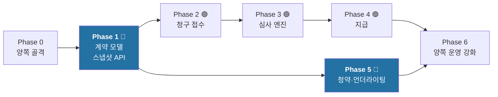

# 08. 구현 로드맵 — business-support 관점

> **통합 로드맵 정본은 `insurance-claims-platform/docs/design/08-roadmap.md`다.**
> 이 문서는 BS가 담당하는 Phase(0, 1, 5, 6)를 상세화한다.

---

## 1. 전체 순서 속 BS의 위치



**BS가 병목이다.** Phase 1이 끝나야 claims가 Phase 2로 갈 수 있다.
그래서 **계약 모델과 스냅샷 API를 먼저** 하고, 청약·언더라이팅은 뒤로 미룬다.

> 직관적으로는 "청약 → 언더라이팅 → 계약" 순서가 자연스러워 보인다.
> 하지만 claims가 필요로 하는 것은 **결과물인 계약**이지 그 생성 과정이 아니다.
> Phase 1에서는 계약을 **테스트 데이터로 직접 심어** 스냅샷 API를 먼저 완성하고,
> 실제 청약·인수 흐름은 Phase 5에서 붙인다. 이것이 claims의 대기 시간을 최소화한다.

---

## Phase 0 — 골격 (양쪽 공통)

[claims 로드맵 Phase 0](https://github.com/hyunolike/insurance-claims-platform/blob/develop/docs/design/08-roadmap.md)과 동일.

### BS 고유 작업

| # | 작업 |
|---|---|
| 0-B1 | `btree_gist` 확장 마이그레이션 (`V1__extensions.sql`) |
| 0-B2 | `Temporal` 인터페이스 + 이력 불변 트리거 |
| 0-B3 | ArchUnit: 이력 엔티티에 세터 금지 규칙 |
| 0-B4 | 포트 8081 / DB 5433 / Redis 6380으로 설정 (claims와 동시 기동) |

### 완료 조건

```
□ ./gradlew build 통과
□ policy-domain에 Spring 추가 시 빌드 실패 확인
□ Testcontainers PostgreSQL + Flyway 실행 확인
□ EXCLUDE 제약이 동작하는지 확인 (겹치는 구간 INSERT → 실패)
□ 이력 트리거가 UPDATE를 거부하는지 확인
□ CI가 PR에서 동작
□ claims와 동시에 로컬 기동 가능 (포트 충돌 없음)
```

---

## Phase 1 🔵 — 계약 모델 + 스냅샷 API

**claims의 진행을 여는 열쇠. 가장 중요한 단계.**

### 1-A. 도메인

| # | 작업 | 완료 기준 |
|---|---|---|
| 1-1 | `Temporal` 인터페이스 + `isEffectiveOn(asOf, knownAt)` | 순수 단위 테스트 |
| 1-2 | `Policy` 애그리거트 + `snapshotAsOf()` | DB 없이 테스트 가능 |
| 1-3 | `Coverage` · `Exclusion` (시간축 보유) | — |
| 1-4 | `PolicyStatus` + `PolicyTransitions` 전이표 | 위반 시 예외 |
| 1-5 | `Money` (원 단위 정수), `PolicyNo` (시퀀스) | — |
| 1-6 | `SnapshotChecksum` (정규화 JSON SHA-256) | claims와 동일 알고리즘 |

### 1-B. 영속성

| # | 작업 |
|---|---|
| 1-7 | `policy` + `policy_version` + `coverage_version` + `exclusion_version` |
| 1-8 | `EXCLUDE USING gist` 겹침 방지 제약 |
| 1-9 | 이력 불변 트리거 + DB 권한 제한 |
| 1-10 | `findAsOf(no, asOf, knownAt)` — 필요한 행만 로드 |
| 1-11 | `correction_log` (승인자 필수) |

### 1-C. API

| # | 작업 |
|---|---|
| 1-12 | **`GET /policies/{no}/snapshot?asOf=&knownAt=`** |
| 1-13 | 스코프 기반 인가 + 조회 감사 로그 |
| 1-14 | Redis 캐시 (과거 영구 / 현재 5분) |
| 1-15 | `GET /policies/{no}` · `GET /policies/{no}/history` |
| 1-16 | `POST /policies/{no}/endorsements` · `/corrections` |

### 1-D. 이벤트

| # | 작업 |
|---|---|
| 1-17 | Outbox 테이블 + `OutboxAppender` |
| 1-18 | 폴링 릴레이 (`FOR UPDATE SKIP LOCKED`) |
| 1-19 | `policy.issued` / `endorsed` / `lapsed` / `terminated` |
| 1-20 | **`policy.corrected`** + 캐시 무효화 |

### 1-E. 테스트 데이터

| # | 작업 |
|---|---|
| 1-21 | 시드: 4세대 실손 정상 계약 |
| 1-22 | 시드: **부담보(척추 M40-M54 5년) 계약** ← claims 골든 케이스용 |
| 1-23 | 시드: 실효 계약 / 유예기간 계약 |
| 1-24 | 시드: **정정 이력이 있는 계약** ← Bitemporal 검증용 |

### 1-F. 계약 테스트

| # | 작업 |
|---|---|
| 1-25 | claims의 계약 픽스처를 `src/test/resources/contracts/`에 배치 |
| 1-26 | `contractTest` 태스크 + CI 편입 |

### 완료 조건 ★

```
□ 같은 계약을 asOf 달리 조회 → 다른 스냅샷
□ 같은 asOf를 knownAt 달리 조회 → 정정 전/후가 각각 재현됨
□ 같은 (policyNo, asOf, knownAt) 100회 조회 → 100회 동일 응답
□ 변경(Endorsement) 후에도 과거 스냅샷 불변
□ 정정(Correction) 후 policy.corrected 발행 + 캐시 무효화
□ 겹치는 유효기간 INSERT → DB가 거부
□ 이력 레코드 UPDATE → 트리거가 거부
□ 응답에 고지사항·주소·모집인 정보 없음 (네거티브 테스트)
□ checksum이 claims 알고리즘과 일치
□ 계약 테스트 전건 통과
□ p99 < 300ms
□ 도메인 모듈 브랜치 커버리지 85%+
```

**이 체크리스트가 전부 통과하면 claims에 Phase 2 시작을 알린다.**

---

## Phase 5 🔵 — 청약 + 언더라이팅

**claims Phase 2~4와 병행 가능.** BS가 더 이상 병목이 아니다.

### 5-A. 청약

| # | 작업 |
|---|---|
| 5-1 | `Application` 애그리거트 + 상태머신 |
| 5-2 | `DisclosureItem` + **암호화 저장** |
| 5-3 | `POST /applications` (멱등) · `GET /applications/{no}` |
| 5-4 | 청약철회 |
| 5-5 | `application.submitted` 이벤트 |

### 5-B. 언더라이팅 엔진

| # | 작업 |
|---|---|
| 5-6 | `UnderwritingContext` 사전 적재 |
| 5-7 | Stage 1~2: 형식 검증 · 인수 가능성 (`U-FMT-*`, `U-ELG-*`) |
| 5-8 | Stage 3: **고지 평가** + `uw_exclusion_mapping` 테이블 (`U-DSC-*`) |
| 5-9 | Stage 4~5: 위험 산정 · 조건 결정 (`U-RSK-*`, `U-CND-*`) |
| 5-10 | Stage 6~7: 보유한도 · 라우팅 |
| 5-11 | `UwRuleTrace` (append-only, 질병명 원문 미포함) |
| 5-12 | **골든 케이스 세트** |

### 5-C. 인수 → 계약

| # | 작업 |
|---|---|
| 5-13 | UW 심사자 API (큐, 상세, 결정) |
| 5-14 | `ConsentRecord` + **동의 없이 부담보 계약 성립 차단** |
| 5-15 | `POST /policies` — 인수 결정 → `Policy` + `Exclusion` 변환 |
| 5-16 | `Exclusion.uwCaseNo` 역추적 경로 |
| 5-17 | 책임개시일 = max(승낙일, 초회납입일) |

### 5-D. 계약 보전

| # | 작업 |
|---|---|
| 5-18 | `PremiumAccount` + 수납 (멱등) |
| 5-19 | 납입최고 → 유예 → 실효 (최고 기록 없으면 실효 불가) |
| 5-20 | **부활** + 재고지 + 재심사 + **면책기간 재기산** |
| 5-21 | 해지 · 만기 |
| 5-22 | `claim.paid` 구독 → `loss_statistics` 적재 |

### 완료 조건

```
□ 청약 → AUW → 자동 인수 → policy.issued 전 흐름 동작
□ 골든 케이스 전건 통과 (03-underwriting.md §4 예시 1~3)
□ 부담보 결정이 스냅샷 API 응답에 나타난다
□ 동의 기록 없이 부담보 계약 성립 → 409
□ 자동 제안과 다른 결정 시 overrideReason 없으면 400
□ 최고 발송 없이 실효 전환 → 거부
□ 부활 시 면책기간 재기산 확인
□ claim.paid 수신 시 통계만 적재, 계약 상태 불변
□ 언더라이팅 모듈 브랜치 커버리지 85%+
```

### 5-E. 레포 간 E2E ★

```
□ 부담보 인수 계약 생성 (Phase 5)
    → claims에서 M51.2 청구 접수 (Phase 2)
    → 스냅샷에 부담보 포함 확인
    → 심사 결과 D-POL-004 부지급 (Phase 3)
    → Exclusion.uwCaseNo로 UwRuleTrace까지 역추적 가능

□ policy.corrected 발행 (부담보 착오 정정)
    → claims가 해당 청구를 재심사 대상으로 표시
    → 심사자 큐에 나타남
```

**이 두 시나리오가 통과하면 두 레포가 하나의 시스템으로 동작한다는 증명이 된다.**

---

## Phase 6 — 운영 강화 (양쪽)

### BS 고유 작업

| # | 작업 |
|---|---|
| 6-B1 | 고지사항 조회 감사 (`DISCLOSURE_VIEW`) |
| 6-B2 | 스냅샷 조회 감사 (`SNAPSHOT_FETCH`) |
| 6-B3 | `audit_log` 파티셔닝 |
| 6-B4 | 스냅샷 API 부하 테스트 (p99 < 300ms 검증) |
| 6-B5 | 캐시 적중률 측정 및 튜닝 |
| 6-B6 | `uw.override_rate` 대시보드 — **룰 품질 지표** |
| 6-B7 | `policy.corrected` 급증 알림 — 데이터 품질 신호 |
| 6-B8 | OpenAPI 생성 + CI drift 검사 |
| 6-B9 | 런북 (스냅샷 API 장애, 정정 롤백 절차) |

### 완료 조건

```
□ 민감정보가 로그·이벤트·API 응답에 평문으로 없음 (자동 검사)
□ 고지사항 조회가 전건 감사 기록됨
□ traceId로 claims 접수 → BS 스냅샷 조회까지 한 화면 추적
□ 스냅샷 API p99 < 300ms (부하 상태)
□ OpenAPI drift 검사 동작
```

---

## 2. 단계별 데모

| Phase | 데모 |
|---|---|
| 0 | "이력 레코드를 UPDATE하면 DB가 거부합니다" |
| **1** | **"같은 계약을 다른 시점으로 조회하면 다른 답이 나오고, 정정 전 답도 재현됩니다"** |
| 5 | "5년 내 수술 이력 고지 → 자동으로 척추 부담보가 붙고, 2년 뒤 그 부위 청구가 정확히 부지급됩니다" |
| 6 | "고지사항을 누가 언제 봤는지 전부 기록됩니다" |

> Phase 1의 데모가 이 저장소의 정체성이다.
> **Bitemporal 시점 조회**는 실무에서 반드시 필요하지만 대부분의 포트폴리오에 없다.

---

## 3. 범위 제외

| 제외 | 이유 |
|---|---|
| 설계사·GA 수수료 정산 | 별도 도메인 |
| 상품 개발·요율 산출 | 계리 영역. 상품 마스터는 주어진 데이터 |
| 실제 수납 연동 (CMS/PG) | 포트 + 스텁 |
| 재보험 출재 | 별도 도메인 |
| 실제 신용정보원·의료기관 조회 | 포트 + 스텁 |
| 프론트엔드 | 백엔드 설계가 목적 |

---

## 4. 작업 추적

| 규칙 | 내용 |
|---|---|
| 마일스톤 | `Phase 0`, `Phase 1`, `Phase 5`, `Phase 6` |
| 이슈 제목 | `[Phase 1] 스냅샷 시점 조회 구현` |
| 브랜치 | `feat/#이슈번호` |
| 커밋 | `feat: Bitemporal 시점 조회 구현 #12` |
| PR | 완료 조건 체크리스트를 본문에 복사 |
| 머지 | **CI 통과 필수** (contractTest 포함) |

### 4.1 레포 간 조율

Phase 1 완료 시 **claims 레포에 이슈를 생성**해 Phase 2 시작을 알린다.
계약 픽스처가 바뀌면 양쪽 레포에 동시에 반영한다.

---

## 관련 문서

- [`01-context-map.md`](01-context-map.md) — 두 레포 경계
- [`02-domain-model.md`](02-domain-model.md) — Bitemporal 애그리거트
- [`03-underwriting.md`](03-underwriting.md) — 언더라이팅 룰
- claims: `docs/design/08-roadmap.md` (통합 로드맵 정본)
